# KaamWala — Architecture Walkthrough

> **KaamWala** is a hyperlocal worker marketplace connecting skilled workers (carpenters, plumbers, electricians, etc.) with customers — featuring reverse bidding, AI cost estimates, verified profiles, and fair pricing.

> [!NOTE]
> This document is designed so that **any new developer** can understand the entire KaamWala system from end to end. Read it top-to-bottom, or jump to the section you need.

---

## Table of Contents

1. [System Architecture](#1-system-architecture)
2. [Backend Architecture (Spring Boot)](#2-backend-architecture-spring-boot)
3. [Database Architecture](#3-database-architecture)
4. [Security Architecture](#4-security-architecture)
5. [Real-time Communication](#5-real-time-communication)
6. [Android App Architecture](#6-android-app-architecture)
7. [AI Cost Estimation Module](#7-ai-cost-estimation-module)
8. [Payment Architecture](#8-payment-architecture)
9. [Deployment Architecture](#9-deployment-architecture)
10. [Scalability Plan](#10-scalability-plan)

---

## 1. System Architecture

### 1.1 High-Level System Diagram

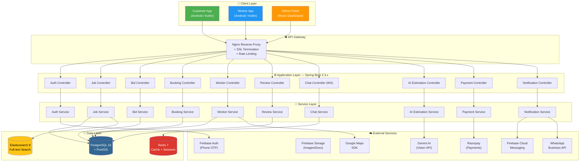
```mermaid
graph TB
    subgraph "📱 Client Layer"
        CA["Customer App<br/>(Android / Kotlin)"]
        WA["Worker App<br/>(Android / Kotlin)"]
        AP["Admin Panel<br/>(React Dashboard)"]
    end

    subgraph "🌐 API Gateway"
        NG["Nginx Reverse Proxy<br/>+ SSL Termination<br/>+ Rate Limiting"]
    end

    subgraph "⚙️ Application Layer — Spring Boot 3.3.x"
        AC["Auth Controller"]
        JC["Job Controller"]
        BC["Bid Controller"]
        BKC["Booking Controller"]
        WC["Worker Controller"]
        RC["Review Controller"]
        CC["Chat Controller (WS)"]
        AIC["AI Estimation Controller"]
        PC["Payment Controller"]
        NC["Notification Controller"]
    end

    subgraph "🧠 Service Layer"
        AS["Auth Service"]
        JS["Job Service"]
        BS["Bid Service"]
        BKS["Booking Service"]
        WS["Worker Service"]
        RS["Review Service"]
        CS["Chat Service"]
        AIS["AI Estimation Service"]
        PS["Payment Service"]
        NS["Notification Service"]
    end

    subgraph "💾 Data Layer"
        PG[("PostgreSQL 16<br/>+ PostGIS")]
        RD[("Redis 7<br/>Cache + Sessions")]
        ES[("Elasticsearch 8<br/>Full-text Search")]
    end

    subgraph "☁️ External Services"
        FA["Firebase Auth<br/>(Phone OTP)"]
        FS["Firebase Storage<br/>(Images/Docs)"]
        FCM["Firebase Cloud<br/>Messaging"]
        RP["Razorpay<br/>(Payments)"]
        GM["Google Maps<br/>SDK"]
        GAI["Gemini AI<br/>(Vision API)"]
        WB["WhatsApp<br/>Business API"]
    end

    CA & WA --> NG
    AP --> NG
    NG --> AC & JC & BC & BKC & WC & RC & CC & AIC & PC & NC

    AC --> AS --> FA
    JC --> JS
    BC --> BS
    BKC --> BKS
    WC --> WS
    RC --> RS
    CC --> CS
    AIC --> AIS --> GAI
    PC --> PS --> RP
    NC --> NS --> FCM & WB

    JS & BS & BKS & WS & RS --> PG
    CS --> RD
    JS --> ES
    WS --> GM

    style CA fill:#4CAF50,color:#fff
    style WA fill:#2196F3,color:#fff
    style AP fill:#FF9800,color:#fff
    style PG fill:#336791,color:#fff
    style RD fill:#DC382D,color:#fff
    style ES fill:#FEC514,color:#000
```

### 1.2 Component Diagram — Microservice-Ready Modules

The system is built as a **modular monolith** — cleanly separated services that can be extracted into microservices when scale demands it.

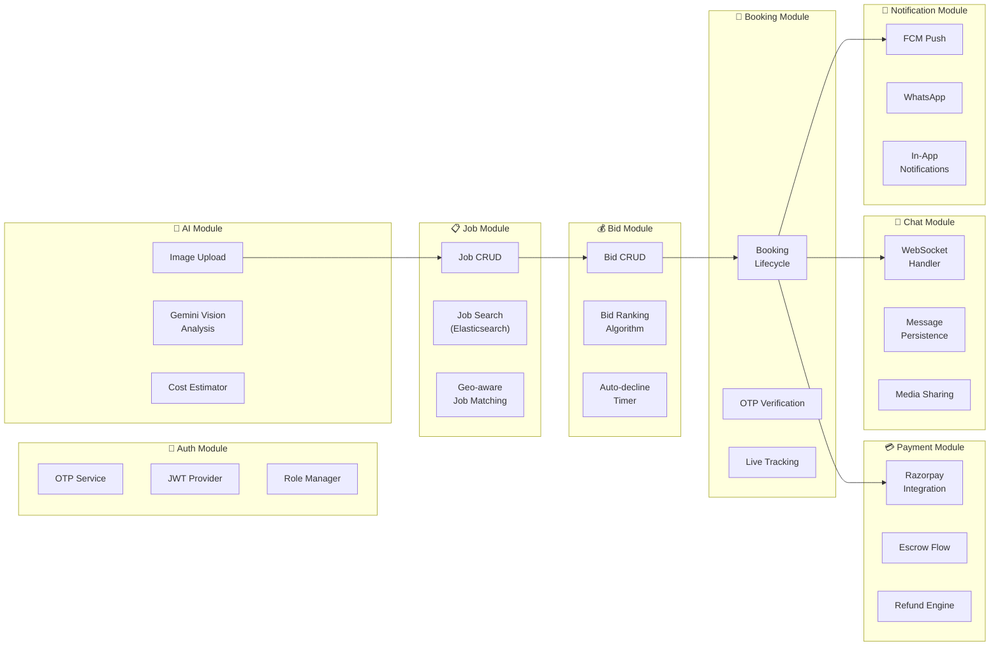
```mermaid
graph LR
    subgraph "🔐 Auth Module"
        A1["OTP Service"]
        A2["JWT Provider"]
        A3["Role Manager"]
    end

    subgraph "📋 Job Module"
        J1["Job CRUD"]
        J2["Job Search<br/>(Elasticsearch)"]
        J3["Geo-aware<br/>Job Matching"]
    end

    subgraph "💰 Bid Module"
        B1["Bid CRUD"]
        B2["Bid Ranking<br/>Algorithm"]
        B3["Auto-decline<br/>Timer"]
    end

    subgraph "📅 Booking Module"
        BK1["Booking<br/>Lifecycle"]
        BK2["OTP Verification"]
        BK3["Live Tracking"]
    end

    subgraph "💳 Payment Module"
        P1["Razorpay<br/>Integration"]
        P2["Escrow Flow"]
        P3["Refund Engine"]
    end

    subgraph "💬 Chat Module"
        C1["WebSocket<br/>Handler"]
        C2["Message<br/>Persistence"]
        C3["Media Sharing"]
    end

    subgraph "🔔 Notification Module"
        N1["FCM Push"]
        N2["WhatsApp"]
        N3["In-App<br/>Notifications"]
    end

    subgraph "🤖 AI Module"
        AI1["Image Upload"]
        AI2["Gemini Vision<br/>Analysis"]
        AI3["Cost Estimator"]
    end

    J1 --> B1
    B1 --> BK1
    BK1 --> P1
    BK1 --> C1
    BK1 --> N1
    AI1 --> J1
```

### 1.3 Data Flow — Customer Posts Job → Receives Bids → Books Worker

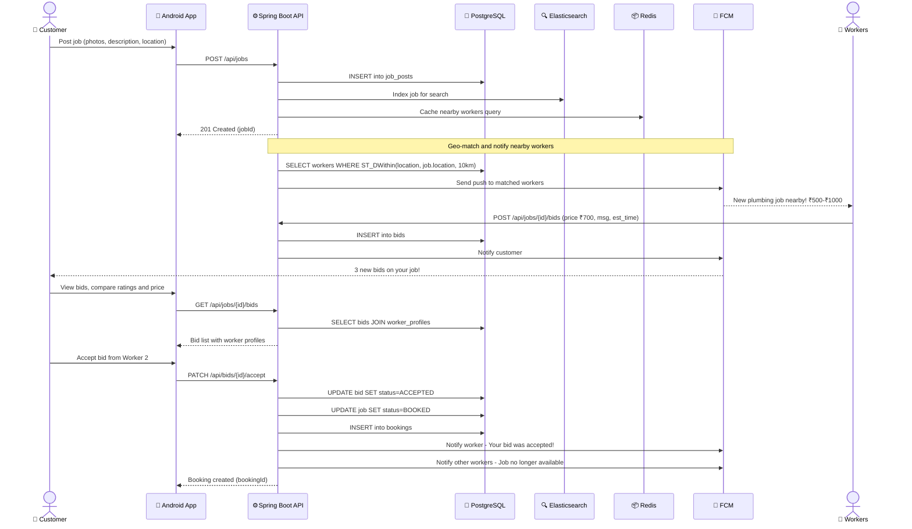
```mermaid
sequenceDiagram
    actor C as 👤 Customer
    participant App as 📱 Android App
    participant API as ⚙️ Spring Boot API
    participant DB as 💾 PostgreSQL
    participant ES as 🔍 Elasticsearch
    participant Redis as 📦 Redis
    participant FCM as 🔔 FCM
    actor W as 🔧 Workers

    C->>App: Post job (photos, description, location)
    App->>API: POST /api/jobs
    API->>DB: INSERT into job_posts
    API->>ES: Index job for search
    API->>Redis: Cache nearby workers query
    API-->>App: 201 Created (jobId)

    Note over API,FCM: Geo-match and notify nearby workers

    API->>DB: SELECT workers WHERE ST_DWithin(location, job.location, 10km)
    API->>FCM: Send push to matched workers
    FCM-->>W: New plumbing job nearby! ₹500-₹1000

    W->>API: POST /api/jobs/{id}/bids (price ₹700, msg, est_time)
    API->>DB: INSERT into bids
    API->>FCM: Notify customer
    FCM-->>C: 3 new bids on your job!

    C->>App: View bids, compare ratings and price
    App->>API: GET /api/jobs/{id}/bids
    API->>DB: SELECT bids JOIN worker_profiles
    API-->>App: Bid list with worker profiles

    C->>App: Accept bid from Worker 2
    App->>API: PATCH /api/bids/{id}/accept
    API->>DB: UPDATE bid SET status=ACCEPTED
    API->>DB: UPDATE job SET status=BOOKED
    API->>DB: INSERT into bookings
    API->>FCM: Notify worker - Your bid was accepted!
    API->>FCM: Notify other workers - Job no longer available
    API-->>App: Booking created (bookingId)
```

### 1.4 Data Flow — Worker Signup → Verification → Job Alerts

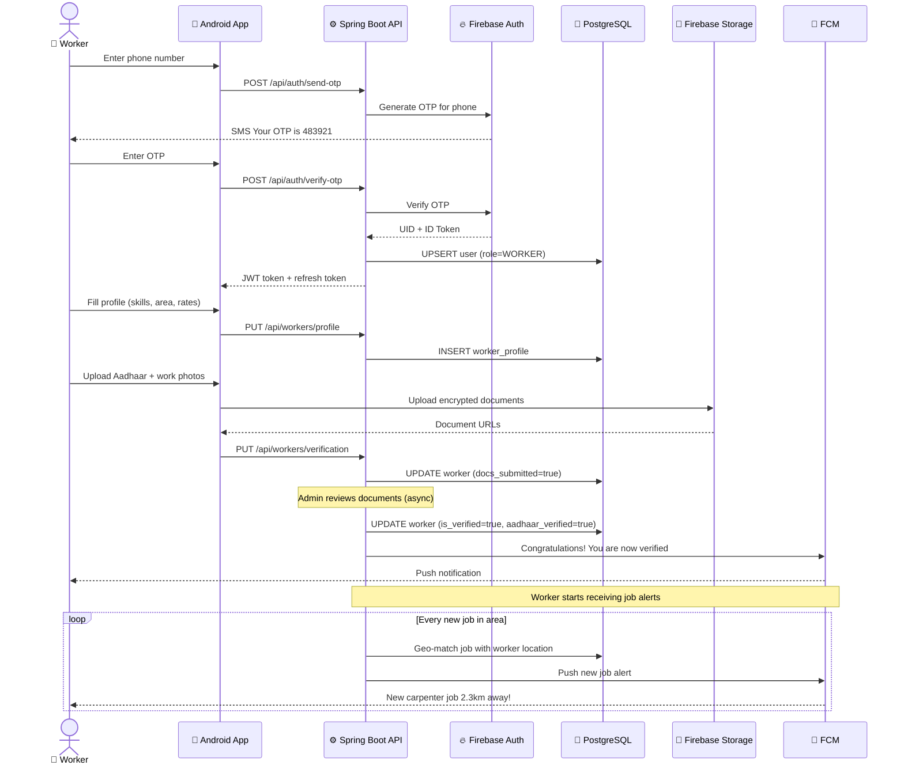
```mermaid
sequenceDiagram
    actor W as 🔧 Worker
    participant App as 📱 Android App
    participant API as ⚙️ Spring Boot API
    participant FB as 🔥 Firebase Auth
    participant DB as 💾 PostgreSQL
    participant Store as 📂 Firebase Storage
    participant FCM as 🔔 FCM

    W->>App: Enter phone number
    App->>API: POST /api/auth/send-otp
    API->>FB: Generate OTP for phone
    FB-->>W: SMS Your OTP is 483921

    W->>App: Enter OTP
    App->>API: POST /api/auth/verify-otp
    API->>FB: Verify OTP
    FB-->>API: UID + ID Token
    API->>DB: UPSERT user (role=WORKER)
    API-->>App: JWT token + refresh token

    W->>App: Fill profile (skills, area, rates)
    App->>API: PUT /api/workers/profile
    API->>DB: INSERT worker_profile

    W->>App: Upload Aadhaar + work photos
    App->>Store: Upload encrypted documents
    Store-->>App: Document URLs
    App->>API: PUT /api/workers/verification
    API->>DB: UPDATE worker (docs_submitted=true)

    Note over API: Admin reviews documents (async)
    API->>DB: UPDATE worker (is_verified=true, aadhaar_verified=true)
    API->>FCM: Congratulations! You are now verified
    FCM-->>W: Push notification

    Note over API,FCM: Worker starts receiving job alerts
    loop Every new job in area
        API->>DB: Geo-match job with worker location
        API->>FCM: Push new job alert
        FCM-->>W: New carpenter job 2.3km away!
    end
```

### 1.5 Data Flow — Emergency Booking

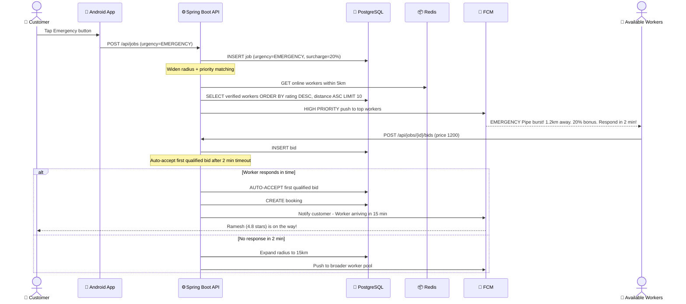
```mermaid
sequenceDiagram
    actor C as 👤 Customer
    participant App as 📱 Android App
    participant API as ⚙️ Spring Boot API
    participant DB as 💾 PostgreSQL
    participant Redis as 📦 Redis
    participant FCM as 🔔 FCM
    actor W as 🔧 Available Workers

    C->>App: Tap Emergency button
    App->>API: POST /api/jobs (urgency=EMERGENCY)
    API->>DB: INSERT job (urgency=EMERGENCY, surcharge=20%)

    Note over API: Widen radius + priority matching
    API->>Redis: GET online workers within 5km
    API->>DB: SELECT verified workers ORDER BY rating DESC, distance ASC LIMIT 10
    API->>FCM: HIGH PRIORITY push to top workers
    FCM-->>W: EMERGENCY Pipe burst! 1.2km away. 20% bonus. Respond in 2 min!

    W->>API: POST /api/jobs/{id}/bids (price 1200)
    API->>DB: INSERT bid

    Note over API: Auto-accept first qualified bid after 2 min timeout
    alt Worker responds in time
        API->>DB: AUTO-ACCEPT first qualified bid
        API->>DB: CREATE booking
        API->>FCM: Notify customer - Worker arriving in 15 min
        FCM-->>C: Ramesh (4.8 stars) is on the way!
    else No response in 2 min
        API->>DB: Expand radius to 15km
        API->>FCM: Push to broader worker pool
    end
```

### 1.6 Data Flow — Payment

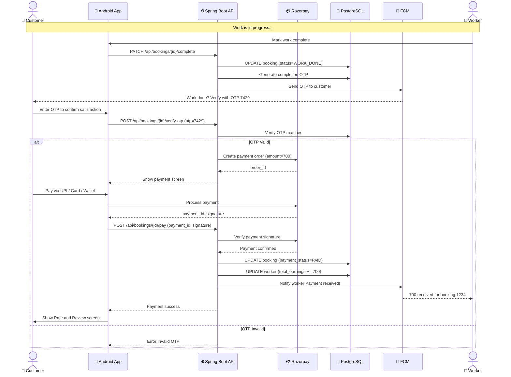
```mermaid
sequenceDiagram
    actor C as 👤 Customer
    participant App as 📱 Android App
    participant API as ⚙️ Spring Boot API
    participant RP as 💳 Razorpay
    participant DB as 💾 PostgreSQL
    participant FCM as 🔔 FCM
    actor W as 🔧 Worker

    Note over C,W: Work is in progress...

    W->>App: Mark work complete
    App->>API: PATCH /api/bookings/{id}/complete
    API->>DB: UPDATE booking (status=WORK_DONE)
    API->>DB: Generate completion OTP
    API->>FCM: Send OTP to customer
    FCM-->>C: Work done? Verify with OTP 7429

    C->>App: Enter OTP to confirm satisfaction
    App->>API: POST /api/bookings/{id}/verify-otp (otp=7429)
    API->>DB: Verify OTP matches

    alt OTP Valid
        API->>RP: Create payment order (amount=700)
        RP-->>API: order_id
        API-->>App: Show payment screen

        C->>App: Pay via UPI / Card / Wallet
        App->>RP: Process payment
        RP-->>App: payment_id, signature

        App->>API: POST /api/bookings/{id}/pay (payment_id, signature)
        API->>RP: Verify payment signature
        RP-->>API: Payment confirmed

        API->>DB: UPDATE booking (payment_status=PAID)
        API->>DB: UPDATE worker (total_earnings += 700)
        API->>FCM: Notify worker Payment received!
        FCM-->>W: 700 received for booking 1234

        API-->>App: Payment success
        App->>C: Show Rate and Review screen
    else OTP Invalid
        API-->>App: Error Invalid OTP
    end
```

---

## 2. Backend Architecture (Spring Boot)

### 2.1 Clean Architecture Layers


```mermaid
graph TB
    subgraph "🌐 Presentation Layer - Controllers"
        direction LR
        C1["AuthController"]
        C2["JobController"]
        C3["BidController"]
        C4["BookingController"]
        C5["WorkerController"]
        C6["ReviewController"]
        C7["ChatController"]
        C8["AIEstimationController"]
        C9["PaymentController"]
        C10["NotificationController"]
    end

    subgraph "📦 DTO Layer"
        direction LR
        D1["Request DTOs"]
        D2["Response DTOs"]
        D3["Mapper Classes"]
    end

    subgraph "🧠 Service Layer - Business Logic"
        direction LR
        S1["AuthService"]
        S2["JobService"]
        S3["BidService"]
        S4["BookingService"]
        S5["WorkerService"]
        S6["ReviewService"]
        S7["ChatService"]
        S8["AIEstimationService"]
        S9["PaymentService"]
        S10["NotificationService"]
    end

    subgraph "🗃️ Repository Layer - Data Access"
        direction LR
        R1["UserRepository"]
        R2["WorkerProfileRepository"]
        R3["JobRepository"]
        R4["BidRepository"]
        R5["BookingRepository"]
        R6["ReviewRepository"]
        R7["ChatMessageRepository"]
        R8["NotificationRepository"]
    end

    subgraph "📐 Entity Layer - Domain Models"
        direction LR
        E1["User"]
        E2["WorkerProfile"]
        E3["JobPost"]
        E4["Bid"]
        E5["Booking"]
        E6["Review"]
        E7["ChatMessage"]
        E8["Notification"]
    end

    subgraph "⚙️ Configuration Layer"
        direction LR
        CF1["SecurityConfig"]
        CF2["WebSocketConfig"]
        CF3["RedisConfig"]
        CF4["CorsConfig"]
        CF5["SwaggerConfig"]
    end

    subgraph "🛡️ Security Layer"
        direction LR
        SEC1["JwtTokenProvider"]
        SEC2["JwtAuthFilter"]
        SEC3["CustomUserDetailsService"]
    end

    C1 & C2 & C3 & C4 & C5 & C6 & C7 & C8 & C9 & C10 --> D1 & D2
    D1 & D2 --> S1 & S2 & S3 & S4 & S5 & S6 & S7 & S8 & S9 & S10
    S1 & S2 & S3 & S4 & S5 & S6 & S7 & S8 & S9 & S10 --> R1 & R2 & R3 & R4 & R5 & R6 & R7 & R8
    R1 & R2 & R3 & R4 & R5 & R6 & R7 & R8 --> E1 & E2 & E3 & E4 & E5 & E6 & E7 & E8

    style C1 fill:#4CAF50,color:#fff
    style S1 fill:#2196F3,color:#fff
    style R1 fill:#FF9800,color:#fff
    style E1 fill:#9C27B0,color:#fff
```

### 2.2 Package Structure

```
backend/src/main/java/com/kaamwala/
├── KaamwalaApplication.java              # Main Spring Boot application
│
├── config/                                # Configuration classes
│   ├── SecurityConfig.java               # Spring Security filter chain
│   ├── WebSocketConfig.java              # STOMP WebSocket configuration
│   ├── RedisConfig.java                  # Redis connection + template
│   ├── CorsConfig.java                   # Cross-origin settings
│   ├── ElasticsearchConfig.java          # Elasticsearch client config
│   └── SwaggerConfig.java               # OpenAPI 3 documentation
│
├── controller/                            # REST + WS Controllers
│   ├── AuthController.java               # /api/auth/*
│   ├── JobController.java                # /api/jobs/*
│   ├── BidController.java                # /api/bids/*
│   ├── BookingController.java            # /api/bookings/*
│   ├── WorkerController.java             # /api/workers/*
│   ├── ReviewController.java             # /api/reviews/*
│   ├── ChatController.java               # /api/chat/*
│   ├── AIEstimationController.java       # /api/ai/*
│   ├── PaymentController.java            # /api/payments/*
│   └── NotificationController.java       # /api/notifications/*
│
├── dto/                                   # Data Transfer Objects
│   ├── request/                           # Incoming request bodies
│   │   ├── SendOtpRequest.java
│   │   ├── VerifyOtpRequest.java
│   │   ├── CreateJobRequest.java
│   │   ├── SubmitBidRequest.java
│   │   ├── CreateBookingRequest.java
│   │   ├── SubmitReviewRequest.java
│   │   ├── WorkerProfileRequest.java
│   │   ├── PaymentRequest.java
│   │   └── AIEstimationRequest.java
│   └── response/                          # Outgoing response bodies
│       ├── AuthResponse.java
│       ├── JobResponse.java
│       ├── BidResponse.java
│       ├── BookingResponse.java
│       ├── WorkerProfileResponse.java
│       ├── ReviewResponse.java
│       ├── ChatMessageResponse.java
│       ├── PaymentResponse.java
│       ├── AIEstimationResponse.java
│       ├── NotificationResponse.java
│       └── ApiResponse.java              # Generic wrapper
│
├── entity/                                # JPA Entity classes
│   ├── User.java
│   ├── WorkerProfile.java
│   ├── JobPost.java
│   ├── Bid.java
│   ├── Booking.java
│   ├── Review.java
│   ├── ChatMessage.java
│   ├── Notification.java
│   └── enums/                             # Enum types
│       ├── UserRole.java                  # CUSTOMER, WORKER, ADMIN
│       ├── JobStatus.java                 # OPEN, BOOKED, IN_PROGRESS, COMPLETED, CANCELLED
│       ├── BidStatus.java                 # PENDING, ACCEPTED, REJECTED, EXPIRED
│       ├── BookingStatus.java             # CONFIRMED, IN_PROGRESS, WORK_DONE, PAID, DISPUTED
│       ├── PaymentStatus.java             # PENDING, AUTHORIZED, CAPTURED, REFUNDED
│       ├── UrgencyLevel.java             # NORMAL, URGENT, EMERGENCY
│       ├── MessageType.java              # TEXT, IMAGE, SYSTEM
│       └── NotificationType.java         # JOB_ALERT, BID_UPDATE, BOOKING, PAYMENT, CHAT
│
├── exception/                             # Exception handling
│   ├── GlobalExceptionHandler.java       # @ControllerAdvice
│   ├── ResourceNotFoundException.java
│   ├── UnauthorizedException.java
│   ├── BadRequestException.java
│   ├── PaymentException.java
│   └── RateLimitExceededException.java
│
├── repository/                            # Spring Data JPA Repos
│   ├── UserRepository.java
│   ├── WorkerProfileRepository.java
│   ├── JobRepository.java
│   ├── BidRepository.java
│   ├── BookingRepository.java
│   ├── ReviewRepository.java
│   ├── ChatMessageRepository.java
│   └── NotificationRepository.java
│
├── security/                              # Security components
│   ├── JwtTokenProvider.java             # Generate + validate JWT
│   ├── JwtAuthenticationFilter.java      # OncePerRequestFilter
│   └── CustomUserDetailsService.java     # Load user by phone
│
├── service/                               # Business logic
│   ├── AuthService.java
│   ├── JobService.java
│   ├── BidService.java
│   ├── BookingService.java
│   ├── WorkerService.java
│   ├── ReviewService.java
│   ├── ChatService.java
│   ├── AIEstimationService.java
│   ├── PaymentService.java
│   ├── NotificationService.java
│   └── GeoLocationService.java           # PostGIS queries
│
├── websocket/                             # WebSocket handlers
│   ├── ChatWebSocketHandler.java
│   ├── ChatMessageBroker.java
│   └── WebSocketAuthInterceptor.java
│
└── util/                                  # Utility classes
    ├── PhoneNumberValidator.java
    ├── AadhaarEncryptor.java
    └── DistanceCalculator.java
```

> [!NOTE]
> Source root: [backend/src/main/java/com/kaamwala/](file:///Users/Automation/.gemini/antigravity/scratch/kaamwala/backend/src/main/java/com/kaamwala)

### 2.3 Entity Relationship Diagram

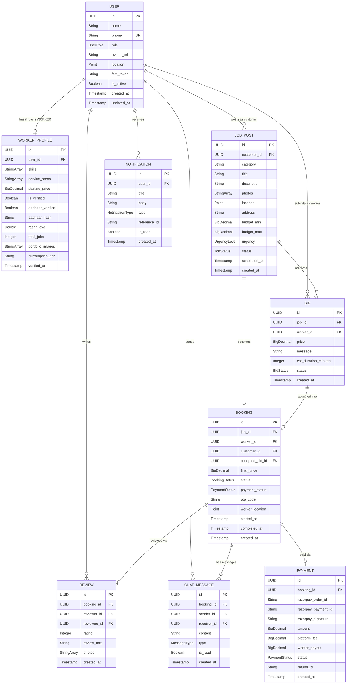
```mermaid
erDiagram
    USER ||--o| WORKER_PROFILE : "has if role is WORKER"
    USER ||--o{ JOB_POST : "posts as customer"
    USER ||--o{ BID : "submits as worker"
    USER ||--o{ REVIEW : "writes"
    USER ||--o{ NOTIFICATION : "receives"
    USER ||--o{ CHAT_MESSAGE : "sends"

    JOB_POST ||--o{ BID : "receives"
    JOB_POST ||--o| BOOKING : "becomes"

    BID ||--o| BOOKING : "accepted into"

    BOOKING ||--o| REVIEW : "reviewed via"
    BOOKING ||--o{ CHAT_MESSAGE : "has messages"
    BOOKING ||--o| PAYMENT : "paid via"

    USER {
        UUID id PK
        String name
        String phone UK
        UserRole role
        String avatar_url
        Point location
        String fcm_token
        Boolean is_active
        Timestamp created_at
        Timestamp updated_at
    }

    WORKER_PROFILE {
        UUID id PK
        UUID user_id FK
        StringArray skills
        StringArray service_areas
        BigDecimal starting_price
        Boolean is_verified
        Boolean aadhaar_verified
        String aadhaar_hash
        Double rating_avg
        Integer total_jobs
        StringArray portfolio_images
        String subscription_tier
        Timestamp verified_at
    }

    JOB_POST {
        UUID id PK
        UUID customer_id FK
        String category
        String title
        String description
        StringArray photos
        Point location
        String address
        BigDecimal budget_min
        BigDecimal budget_max
        UrgencyLevel urgency
        JobStatus status
        Timestamp scheduled_at
        Timestamp created_at
    }

    BID {
        UUID id PK
        UUID job_id FK
        UUID worker_id FK
        BigDecimal price
        String message
        Integer est_duration_minutes
        BidStatus status
        Timestamp created_at
    }

    BOOKING {
        UUID id PK
        UUID job_id FK
        UUID worker_id FK
        UUID customer_id FK
        UUID accepted_bid_id FK
        BigDecimal final_price
        BookingStatus status
        PaymentStatus payment_status
        String otp_code
        Point worker_location
        Timestamp started_at
        Timestamp completed_at
        Timestamp created_at
    }

    REVIEW {
        UUID id PK
        UUID booking_id FK
        UUID reviewer_id FK
        UUID reviewee_id FK
        Integer rating
        String review_text
        StringArray photos
        Timestamp created_at
    }

    CHAT_MESSAGE {
        UUID id PK
        UUID booking_id FK
        UUID sender_id FK
        UUID receiver_id FK
        String content
        MessageType type
        Boolean is_read
        Timestamp created_at
    }

    NOTIFICATION {
        UUID id PK
        UUID user_id FK
        String title
        String body
        NotificationType type
        String reference_id
        Boolean is_read
        Timestamp created_at
    }

    PAYMENT {
        UUID id PK
        UUID booking_id FK
        String razorpay_order_id
        String razorpay_payment_id
        String razorpay_signature
        BigDecimal amount
        BigDecimal platform_fee
        BigDecimal worker_payout
        PaymentStatus status
        String refund_id
        Timestamp created_at
    }
```

### 2.4 API Documentation

#### Auth Endpoints

| Method | Path | Auth | Description |
|--------|------|------|-------------|
| `POST` | `/api/auth/send-otp` | No | Send OTP to phone number |
| `POST` | `/api/auth/verify-otp` | No | Verify OTP, return JWT + refresh token |
| `POST` | `/api/auth/refresh` | No | Refresh access token using refresh token |
| `DELETE` | `/api/auth/logout` | Yes | Invalidate refresh token |

#### Job Endpoints

| Method | Path | Auth | Roles | Description |
|--------|------|------|-------|-------------|
| `POST` | `/api/jobs` | Yes | CUSTOMER | Create a new job post |
| `GET` | `/api/jobs` | Yes | ALL | List jobs with filters: category, lat, lng, radius, status |
| `GET` | `/api/jobs/{id}` | Yes | ALL | Get job details |
| `PATCH` | `/api/jobs/{id}` | Yes | CUSTOMER | Update job post, only if OPEN |
| `DELETE` | `/api/jobs/{id}` | Yes | CUSTOMER | Cancel or delete job |
| `PATCH` | `/api/jobs/{id}/status` | Yes | CUSTOMER | Update job status |
| `GET` | `/api/jobs/my-posts` | Yes | CUSTOMER | Get customer own job posts |

#### Bid Endpoints

| Method | Path | Auth | Roles | Description |
|--------|------|------|-------|-------------|
| `POST` | `/api/jobs/{id}/bids` | Yes | WORKER | Submit bid on a job |
| `GET` | `/api/jobs/{id}/bids` | Yes | CUSTOMER | View all bids on a job |
| `GET` | `/api/bids/my-bids` | Yes | WORKER | Worker own submitted bids |
| `PATCH` | `/api/bids/{id}/accept` | Yes | CUSTOMER | Accept a bid, auto-rejects others |
| `PATCH` | `/api/bids/{id}/reject` | Yes | CUSTOMER | Reject a specific bid |
| `PATCH` | `/api/bids/{id}/withdraw` | Yes | WORKER | Worker withdraws their bid |

#### Booking Endpoints

| Method | Path | Auth | Roles | Description |
|--------|------|------|-------|-------------|
| `POST` | `/api/bookings` | Yes | CUSTOMER | Create booking from accepted bid |
| `GET` | `/api/bookings/{id}` | Yes | BOTH | Get booking details |
| `GET` | `/api/bookings/my-bookings` | Yes | ALL | List user bookings as customer or worker |
| `PATCH` | `/api/bookings/{id}/start` | Yes | WORKER | Worker starts work with customer OTP verify |
| `PATCH` | `/api/bookings/{id}/complete` | Yes | WORKER | Worker marks work as done |
| `POST` | `/api/bookings/{id}/verify-otp` | Yes | CUSTOMER | Customer confirms completion via OTP |
| `PATCH` | `/api/bookings/{id}/cancel` | Yes | BOTH | Cancel booking with reason |
| `GET` | `/api/bookings/{id}/track` | Yes | CUSTOMER | Get live worker location |

#### Worker Endpoints

| Method | Path | Auth | Roles | Description |
|--------|------|------|-------|-------------|
| `GET` | `/api/workers/nearby` | Yes | CUSTOMER | Find nearby workers: lat, lng, category, radius |
| `GET` | `/api/workers/{id}` | Yes | ALL | Get worker public profile |
| `PUT` | `/api/workers/profile` | Yes | WORKER | Update worker profile |
| `PUT` | `/api/workers/verification` | Yes | WORKER | Submit verification documents |
| `GET` | `/api/workers/{id}/portfolio` | Yes | ALL | Get worker portfolio images |
| `PUT` | `/api/workers/location` | Yes | WORKER | Update worker current location |
| `PUT` | `/api/workers/fcm-token` | Yes | WORKER | Update FCM push token |

#### Review Endpoints

| Method | Path | Auth | Roles | Description |
|--------|------|------|-------|-------------|
| `POST` | `/api/bookings/{id}/review` | Yes | CUSTOMER | Submit review for a completed booking |
| `GET` | `/api/workers/{id}/reviews` | Yes | ALL | Get all reviews for a worker |
| `GET` | `/api/reviews/{id}` | Yes | ALL | Get a specific review |

#### Chat Endpoints

| Method | Path | Auth | Description |
|--------|------|------|-------------|
| `WS` | `/ws/chat` | Yes via Token | WebSocket STOMP endpoint for real-time chat |
| `GET` | `/api/chat/{bookingId}/history` | Yes | Get chat message history for a booking |
| `POST` | `/api/chat/{bookingId}/send` | Yes | Send message, REST fallback for poor connections |

#### AI Estimation Endpoints

| Method | Path | Auth | Description |
|--------|------|------|-------------|
| `POST` | `/api/ai/estimate` | Yes | Upload image + description, get AI cost estimate |
| `GET` | `/api/ai/categories` | Yes | List supported estimation categories |

#### Payment Endpoints

| Method | Path | Auth | Description |
|--------|------|------|-------------|
| `POST` | `/api/bookings/{id}/pay` | Yes | Process payment for a booking |
| `POST` | `/api/payments/webhook` | No, Signature verified | Razorpay webhook callback |
| `GET` | `/api/payments/{id}` | Yes | Get payment details |
| `POST` | `/api/payments/{id}/refund` | Yes, ADMIN | Initiate refund |

#### Notification Endpoints

| Method | Path | Auth | Description |
|--------|------|------|-------------|
| `GET` | `/api/notifications` | Yes | Get user notifications, paginated |
| `PATCH` | `/api/notifications/{id}/read` | Yes | Mark notification as read |
| `PATCH` | `/api/notifications/read-all` | Yes | Mark all notifications as read |
| `GET` | `/api/notifications/unread-count` | Yes | Get count of unread notifications |

### 2.5 Request/Response Flow

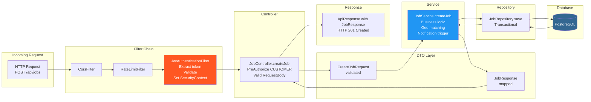
```mermaid
graph LR
    subgraph "Incoming Request"
        A["HTTP Request<br/>POST /api/jobs"]
    end

    subgraph "Filter Chain"
        B["CorsFilter"]
        C["RateLimitFilter"]
        D["JwtAuthenticationFilter<br/>Extract token<br/>Validate<br/>Set SecurityContext"]
    end

    subgraph "Controller"
        E["JobController.createJob<br/>PreAuthorize CUSTOMER<br/>Valid RequestBody"]
    end

    subgraph "DTO Layer"
        F["CreateJobRequest<br/>validated"]
        G["JobResponse<br/>mapped"]
    end

    subgraph "Service"
        H["JobService.createJob<br/>Business logic<br/>Geo matching<br/>Notification trigger"]
    end

    subgraph "Repository"
        I["JobRepository.save<br/>Transactional"]
    end

    subgraph "Database"
        J[("PostgreSQL")]
    end

    A --> B --> C --> D --> E
    E --> F --> H
    H --> I --> J
    J --> I --> H
    H --> G --> E

    subgraph "Response"
        K["ApiResponse with JobResponse<br/>HTTP 201 Created"]
    end

    E --> K

    style D fill:#FF5722,color:#fff
    style H fill:#2196F3,color:#fff
    style J fill:#336791,color:#fff
```

### 2.6 Application Configuration

```yaml
# application.yml
server:
  port: 8080
  servlet:
    context-path: /

spring:
  application:
    name: kaamwala-api

  # PostgreSQL + PostGIS
  datasource:
    url: jdbc:postgresql://localhost:5432/kaamwala
    username: ${DB_USERNAME:kaamwala}
    password: ${DB_PASSWORD:secret}
    driver-class-name: org.postgresql.Driver

  jpa:
    hibernate:
      ddl-auto: validate
    properties:
      hibernate:
        dialect: org.hibernate.spatial.dialect.postgis.PostgisPG95Dialect
        format_sql: true
        jdbc:
          time_zone: Asia/Kolkata
    show-sql: false

  # Redis
  data:
    redis:
      host: ${REDIS_HOST:localhost}
      port: ${REDIS_PORT:6379}
      password: ${REDIS_PASSWORD:}
      timeout: 5000ms

  # Elasticsearch
  elasticsearch:
    uris: ${ELASTICSEARCH_URI:http://localhost:9200}

  # File upload limits
  servlet:
    multipart:
      max-file-size: 10MB
      max-request-size: 50MB

  # Flyway migrations
  flyway:
    enabled: true
    locations: classpath:db/migration

# JWT Configuration
jwt:
  secret: ${JWT_SECRET:your-256-bit-secret-key-here-min-32-chars!!}
  access-token-expiration: 86400000     # 24 hours
  refresh-token-expiration: 2592000000  # 30 days

# Firebase
firebase:
  credentials-path: ${FIREBASE_CREDENTIALS:firebase-service-account.json}
  storage-bucket: ${FIREBASE_BUCKET:kaamwala.appspot.com}

# Razorpay
razorpay:
  key-id: ${RAZORPAY_KEY_ID}
  key-secret: ${RAZORPAY_KEY_SECRET}
  webhook-secret: ${RAZORPAY_WEBHOOK_SECRET}

# Google AI / Gemini
google:
  ai:
    api-key: ${GOOGLE_AI_API_KEY}
    model: gemini-1.5-flash

# WhatsApp Business
whatsapp:
  api-url: https://graph.facebook.com/v18.0
  phone-number-id: ${WHATSAPP_PHONE_NUMBER_ID}
  access-token: ${WHATSAPP_ACCESS_TOKEN}

# Rate Limiting
rate-limit:
  otp:
    max-requests: 5
    window-seconds: 300
  api:
    max-requests: 100
    window-seconds: 60

# Logging
logging:
  level:
    com.kaamwala: DEBUG
    org.springframework.security: INFO
    org.hibernate.SQL: DEBUG
  pattern:
    console: "%d{yyyy-MM-dd HH:mm:ss} [%thread] %-5level %logger{36} - %msg%n"
```

---

## 3. Database Architecture

### 3.1 Full ER Diagram with Relationships

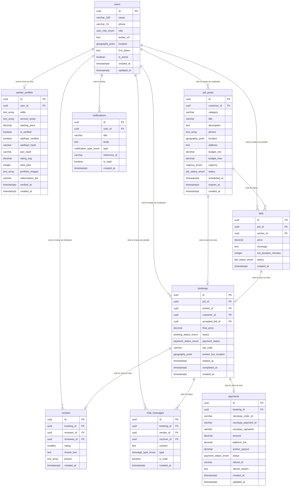
```mermaid
erDiagram
    users ||--o| worker_profiles : "one to zero-or-one"
    users ||--o{ job_posts : "one to many as customer"
    users ||--o{ bids : "one to many as worker"
    users ||--o{ bookings : "one to many as customer"
    users ||--o{ reviews : "one to many as reviewer"
    users ||--o{ chat_messages : "one to many as sender"
    users ||--o{ notifications : "one to many"

    job_posts ||--o{ bids : "one to many"
    job_posts ||--o| bookings : "one to zero-or-one"

    bids ||--o| bookings : "one to zero-or-one"

    bookings ||--o| reviews : "one to zero-or-one"
    bookings ||--o{ chat_messages : "one to many"
    bookings ||--o| payments : "one to zero-or-one"

    users {
        uuid id PK
        varchar_100 name
        varchar_15 phone
        user_role_enum role
        text avatar_url
        geography_point location
        text fcm_token
        boolean is_active
        timestamptz created_at
        timestamptz updated_at
    }

    worker_profiles {
        uuid id PK
        uuid user_id FK
        text_array skills
        text_array service_areas
        decimal starting_price
        boolean is_verified
        boolean aadhaar_verified
        varchar aadhaar_hash
        varchar pan_hash
        decimal rating_avg
        integer total_jobs
        text_array portfolio_images
        varchar subscription_tier
        timestamptz verified_at
        timestamptz created_at
    }

    job_posts {
        uuid id PK
        uuid customer_id FK
        varchar category
        varchar title
        text description
        text_array photos
        geography_point location
        text address
        decimal budget_min
        decimal budget_max
        urgency_enum urgency
        job_status_enum status
        timestamptz scheduled_at
        timestamptz expires_at
        timestamptz created_at
    }

    bids {
        uuid id PK
        uuid job_id FK
        uuid worker_id FK
        decimal price
        text message
        integer est_duration_minutes
        bid_status_enum status
        timestamptz created_at
    }

    bookings {
        uuid id PK
        uuid job_id FK
        uuid worker_id FK
        uuid customer_id FK
        uuid accepted_bid_id FK
        decimal final_price
        booking_status_enum status
        payment_status_enum payment_status
        varchar otp_code
        geography_point worker_live_location
        timestamptz started_at
        timestamptz completed_at
        timestamptz created_at
    }

    reviews {
        uuid id PK
        uuid booking_id FK
        uuid reviewer_id FK
        uuid reviewee_id FK
        smallint rating
        text review_text
        text_array photos
        timestamptz created_at
    }

    chat_messages {
        uuid id PK
        uuid booking_id FK
        uuid sender_id FK
        uuid receiver_id FK
        text content
        message_type_enum type
        boolean is_read
        timestamptz created_at
    }

    notifications {
        uuid id PK
        uuid user_id FK
        varchar title
        text body
        notification_type_enum type
        varchar reference_id
        boolean is_read
        timestamptz created_at
    }

    payments {
        uuid id PK
        uuid booking_id FK
        varchar razorpay_order_id
        varchar razorpay_payment_id
        varchar razorpay_signature
        decimal amount
        decimal platform_fee
        decimal worker_payout
        payment_status_enum status
        varchar refund_id
        text refund_reason
        timestamptz created_at
        timestamptz updated_at
    }
```

### 3.2 Table Descriptions with Column Types

| Table | Rows Est. Year 1 | Primary Index | Description |
|-------|-------------------|---------------|-------------|
| `users` | 50,000 | `id PK`, `phone UNIQUE` | All platform users |
| `worker_profiles` | 10,000 | `id PK`, `user_id UNIQUE FK` | Extended worker data |
| `job_posts` | 200,000 | `id PK`, `customer_id FK` | Customer job postings |
| `bids` | 800,000 | `id PK`, `job_id + worker_id UNIQUE` | Worker bids on jobs |
| `bookings` | 100,000 | `id PK`, `job_id UNIQUE FK` | Confirmed bookings |
| `reviews` | 80,000 | `id PK`, `booking_id UNIQUE FK` | Post-work reviews |
| `chat_messages` | 5,000,000 | `id PK`, `booking_id FK` | Chat messages |
| `notifications` | 10,000,000 | `id PK`, `user_id FK` | All notifications |
| `payments` | 100,000 | `id PK`, `booking_id UNIQUE FK` | Payment records |

### 3.3 Indexing Strategy

```sql
-- ===== USERS =====
CREATE UNIQUE INDEX idx_users_phone ON users(phone);
CREATE INDEX idx_users_role ON users(role);
CREATE INDEX idx_users_location ON users USING GIST(location);
CREATE INDEX idx_users_active ON users(is_active) WHERE is_active = true;

-- ===== WORKER PROFILES =====
CREATE UNIQUE INDEX idx_worker_user_id ON worker_profiles(user_id);
CREATE INDEX idx_worker_verified ON worker_profiles(is_verified) WHERE is_verified = true;
CREATE INDEX idx_worker_skills ON worker_profiles USING GIN(skills);
CREATE INDEX idx_worker_rating ON worker_profiles(rating_avg DESC);
CREATE INDEX idx_worker_subscription ON worker_profiles(subscription_tier);

-- ===== JOB POSTS =====
CREATE INDEX idx_jobs_customer ON job_posts(customer_id);
CREATE INDEX idx_jobs_category ON job_posts(category);
CREATE INDEX idx_jobs_status ON job_posts(status);
CREATE INDEX idx_jobs_urgency ON job_posts(urgency);
CREATE INDEX idx_jobs_location ON job_posts USING GIST(location);
CREATE INDEX idx_jobs_created ON job_posts(created_at DESC);
-- Composite: workers searching for nearby OPEN jobs in a category
CREATE INDEX idx_jobs_search ON job_posts(category, status, created_at DESC)
    WHERE status = 'OPEN';

-- ===== BIDS =====
CREATE UNIQUE INDEX idx_bids_job_worker ON bids(job_id, worker_id);
CREATE INDEX idx_bids_job ON bids(job_id);
CREATE INDEX idx_bids_worker ON bids(worker_id);
CREATE INDEX idx_bids_status ON bids(status);

-- ===== BOOKINGS =====
CREATE UNIQUE INDEX idx_bookings_job ON bookings(job_id);
CREATE INDEX idx_bookings_worker ON bookings(worker_id);
CREATE INDEX idx_bookings_customer ON bookings(customer_id);
CREATE INDEX idx_bookings_status ON bookings(status);
CREATE INDEX idx_bookings_payment ON bookings(payment_status);

-- ===== CHAT MESSAGES =====
CREATE INDEX idx_chat_booking ON chat_messages(booking_id, created_at);
CREATE INDEX idx_chat_unread ON chat_messages(receiver_id, is_read)
    WHERE is_read = false;

-- ===== NOTIFICATIONS =====
CREATE INDEX idx_notif_user ON notifications(user_id, created_at DESC);
CREATE INDEX idx_notif_unread ON notifications(user_id, is_read)
    WHERE is_read = false;

-- ===== PAYMENTS =====
CREATE UNIQUE INDEX idx_payments_booking ON payments(booking_id);
CREATE UNIQUE INDEX idx_payments_rp_order ON payments(razorpay_order_id);
CREATE UNIQUE INDEX idx_payments_rp_payment ON payments(razorpay_payment_id)
    WHERE razorpay_payment_id IS NOT NULL;
```

### 3.4 PostGIS Geolocation Queries

```sql
-- ===== Enable PostGIS extension =====
CREATE EXTENSION IF NOT EXISTS postgis;

-- ===== Find workers within 10km of a customer location =====
-- Uses spatial index for fast querying (milliseconds even with 100K+ rows)
SELECT
    u.id, u.name, u.phone,
    wp.skills, wp.rating_avg, wp.total_jobs, wp.starting_price,
    ST_Distance(
        u.location::geography,
        ST_SetSRID(ST_MakePoint(:lng, :lat), 4326)::geography
    ) AS distance_meters
FROM users u
JOIN worker_profiles wp ON u.id = wp.user_id
WHERE
    u.role = 'WORKER'
    AND u.is_active = true
    AND wp.is_verified = true
    AND :category = ANY(wp.skills)
    AND ST_DWithin(
        u.location::geography,
        ST_SetSRID(ST_MakePoint(:lng, :lat), 4326)::geography,
        10000  -- 10km radius in meters
    )
ORDER BY distance_meters ASC
LIMIT 20;

-- ===== Find OPEN jobs near a worker =====
SELECT
    j.id, j.title, j.category, j.budget_min, j.budget_max, j.urgency,
    ST_Distance(
        j.location::geography,
        ST_SetSRID(ST_MakePoint(:worker_lng, :worker_lat), 4326)::geography
    ) AS distance_meters
FROM job_posts j
WHERE
    j.status = 'OPEN'
    AND j.category = :worker_skill
    AND ST_DWithin(
        j.location::geography,
        ST_SetSRID(ST_MakePoint(:worker_lng, :worker_lat), 4326)::geography,
        15000  -- 15km radius
    )
ORDER BY
    CASE j.urgency
        WHEN 'EMERGENCY' THEN 0
        WHEN 'URGENT' THEN 1
        ELSE 2
    END,
    distance_meters ASC
LIMIT 50;

-- ===== Update worker live location (during active booking) =====
UPDATE bookings
SET worker_live_location = ST_SetSRID(ST_MakePoint(:lng, :lat), 4326)
WHERE id = :booking_id AND worker_id = :worker_id;

-- ===== Calculate ETA between worker and job =====
SELECT
    ST_Distance(
        u.location::geography,
        j.location::geography
    ) / 1000.0 AS distance_km
FROM users u, job_posts j
WHERE u.id = :worker_id AND j.id = :job_id;
-- Note: For actual road-distance ETA, use Google Directions API
```

### 3.5 Redis Caching Strategy

| Key Pattern | Value | TTL | Purpose |
|-------------|-------|-----|---------|
| `otp:{phone}` | `{otp_code, attempts, created_at}` | 5 min | OTP verification; max 3 attempts |
| `jwt:blacklist:{token_hash}` | `true` | Token remaining lifetime | Invalidated JWT tokens |
| `user:session:{user_id}` | `{jwt_token, device_info, last_active}` | 30 days | Active sessions |
| `workers:nearby:{lat}:{lng}:{radius}:{category}` | `List of WorkerProfile` | 2 min | Cache nearby worker search results |
| `jobs:feed:{category}:{city}` | `List of JobPost` | 1 min | Cache job feed for workers |
| `job:bids:{job_id}` | `List of Bid` | 30 sec | Cache bid list for active jobs |
| `worker:online:{worker_id}` | `{lat, lng, timestamp}` | 5 min | Worker online status + location |
| `rate:otp:{phone}` | `counter` | 5 min | OTP rate limiting, max 5 |
| `rate:api:{user_id}` | `counter` | 1 min | API rate limiting, max 100 per min |
| `booking:otp:{booking_id}` | `{otp_code}` | 10 min | Completion verification OTP |
| `notification:unread:{user_id}` | `count` | Event-driven | Unread notification count |
| `chat:typing:{booking_id}:{user_id}` | `true` | 3 sec | Typing indicator |

```java
// Redis cache example — Spring Boot configuration
@Configuration
@EnableCaching
public class RedisConfig {

    @Bean
    public RedisCacheManager cacheManager(RedisConnectionFactory factory) {
        RedisCacheConfiguration config = RedisCacheConfiguration.defaultCacheConfig()
            .entryTtl(Duration.ofMinutes(2))
            .serializeValuesWith(
                RedisSerializationContext.SerializationPair
                    .fromSerializer(new GenericJackson2JsonRedisSerializer())
            );

        Map<String, RedisCacheConfiguration> cacheConfigs = Map.of(
            "nearbyWorkers", config.entryTtl(Duration.ofMinutes(2)),
            "jobsFeed", config.entryTtl(Duration.ofMinutes(1)),
            "bidsList", config.entryTtl(Duration.ofSeconds(30)),
            "workerProfile", config.entryTtl(Duration.ofMinutes(10))
        );

        return RedisCacheManager.builder(factory)
            .cacheDefaults(config)
            .withInitialCacheConfigurations(cacheConfigs)
            .build();
    }
}
```

---

## 4. Security Architecture

### 4.1 Authentication Flow — OTP to JWT

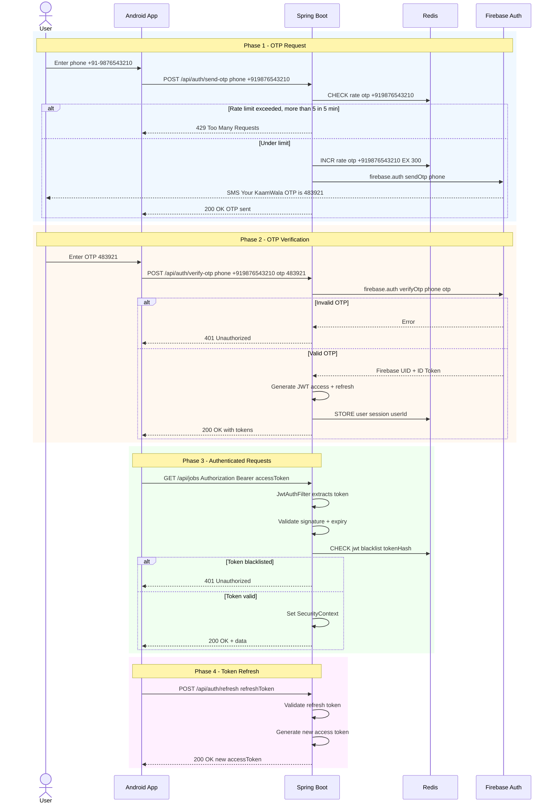
```mermaid
sequenceDiagram
    actor U as User
    participant App as Android App
    participant API as Spring Boot
    participant Redis as Redis
    participant FB as Firebase Auth

    rect rgb(240, 248, 255)
        Note over U,FB: Phase 1 - OTP Request
        U->>App: Enter phone +91-9876543210
        App->>API: POST /api/auth/send-otp phone +919876543210
        API->>Redis: CHECK rate otp +919876543210
        alt Rate limit exceeded, more than 5 in 5 min
            API-->>App: 429 Too Many Requests
        else Under limit
            API->>Redis: INCR rate otp +919876543210 EX 300
            API->>FB: firebase.auth sendOtp phone
            FB-->>U: SMS Your KaamWala OTP is 483921
            API-->>App: 200 OK OTP sent
        end
    end

    rect rgb(255, 248, 240)
        Note over U,FB: Phase 2 - OTP Verification
        U->>App: Enter OTP 483921
        App->>API: POST /api/auth/verify-otp phone +919876543210 otp 483921
        API->>FB: firebase.auth verifyOtp phone otp
        alt Invalid OTP
            FB-->>API: Error
            API-->>App: 401 Unauthorized
        else Valid OTP
            FB-->>API: Firebase UID + ID Token
            API->>API: Generate JWT access + refresh
            API->>Redis: STORE user session userId
            API-->>App: 200 OK with tokens
        end
    end

    rect rgb(240, 255, 240)
        Note over App,API: Phase 3 - Authenticated Requests
        App->>API: GET /api/jobs Authorization Bearer accessToken
        API->>API: JwtAuthFilter extracts token
        API->>API: Validate signature + expiry
        API->>Redis: CHECK jwt blacklist tokenHash
        alt Token blacklisted
            API-->>App: 401 Unauthorized
        else Token valid
            API->>API: Set SecurityContext
            API-->>App: 200 OK + data
        end
    end

    rect rgb(255, 240, 255)
        Note over App,API: Phase 4 - Token Refresh
        App->>API: POST /api/auth/refresh refreshToken
        API->>API: Validate refresh token
        API->>API: Generate new access token
        API-->>App: 200 OK new accessToken
    end
```

### 4.2 JWT Token Structure

```json
// Access Token Payload (24h expiry)
{
  "sub": "550e8400-e29b-41d4-a716-446655440000",
  "phone": "+919876543210",
  "role": "WORKER",
  "name": "Ramesh Kumar",
  "verified": true,
  "iat": 1717430567,
  "exp": 1717516967
}
```

```json
// Refresh Token Payload (30 day expiry)
{
  "sub": "550e8400-e29b-41d4-a716-446655440000",
  "type": "REFRESH",
  "deviceId": "android-xyz-123",
  "iat": 1717430567,
  "exp": 1720022567
}
```

### 4.3 Authorization Levels

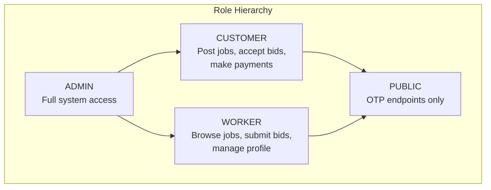
```mermaid
graph TB
    subgraph "Role Hierarchy"
        ADMIN["ADMIN<br/>Full system access"]
        CUSTOMER["CUSTOMER<br/>Post jobs, accept bids,<br/>make payments"]
        WORKER["WORKER<br/>Browse jobs, submit bids,<br/>manage profile"]
        PUBLIC["PUBLIC<br/>OTP endpoints only"]
    end

    ADMIN --> CUSTOMER
    ADMIN --> WORKER
    CUSTOMER --> PUBLIC
    WORKER --> PUBLIC
```

| Endpoint Pattern | PUBLIC | CUSTOMER | WORKER | ADMIN |
|-----------------|--------|----------|--------|-------|
| `POST /api/auth/*` | Yes | Yes | Yes | Yes |
| `POST /api/jobs` | No | Yes | No | Yes |
| `GET /api/jobs` | No | Yes | Yes | Yes |
| `POST /api/jobs/{id}/bids` | No | No | Yes | Yes |
| `PATCH /api/bids/{id}/accept` | No | Yes | No | Yes |
| `POST /api/bookings` | No | Yes | No | Yes |
| `PATCH /api/bookings/{id}/start` | No | No | Yes | Yes |
| `PUT /api/workers/profile` | No | No | Yes | Yes |
| `POST /api/payments/{id}/refund` | No | No | No | Yes |

### 4.4 Security Config

```java
@Configuration
@EnableWebSecurity
@EnableMethodSecurity
public class SecurityConfig {

    @Bean
    public SecurityFilterChain filterChain(HttpSecurity http) throws Exception {
        return http
            .csrf(csrf -> csrf.disable()) // REST API — stateless
            .sessionManagement(session ->
                session.sessionCreationPolicy(SessionCreationPolicy.STATELESS))
            .authorizeHttpRequests(auth -> auth
                // Public endpoints
                .requestMatchers("/api/auth/**").permitAll()
                .requestMatchers("/api/payments/webhook").permitAll()
                .requestMatchers("/ws/**").permitAll()  // WS auth via interceptor
                .requestMatchers("/actuator/health").permitAll()
                .requestMatchers("/swagger-ui/**", "/v3/api-docs/**").permitAll()

                // Role-based
                .requestMatchers(HttpMethod.POST, "/api/jobs").hasRole("CUSTOMER")
                .requestMatchers(HttpMethod.POST, "/api/jobs/*/bids").hasRole("WORKER")
                .requestMatchers("/api/admin/**").hasRole("ADMIN")

                // Everything else requires authentication
                .anyRequest().authenticated()
            )
            .addFilterBefore(jwtAuthFilter, UsernamePasswordAuthenticationFilter.class)
            .build();
    }
}
```

### 4.5 Data Encryption Strategy

| Data | Encryption | Storage | Decryption |
|------|-----------|---------|------------|
| Aadhaar Number | AES-256-GCM | `worker_profiles.aadhaar_hash` | Never, one-way hash for verification |
| PAN Number | AES-256-GCM | `worker_profiles.pan_hash` | Admin-only, audit logged |
| Phone Number | Plain, needed for OTP | `users.phone` | N/A |
| JWT Secret | HMAC-SHA256 | Environment variable | Server-side only |
| Razorpay Keys | N/A | Environment variables | Server-side only |
| Chat Messages | TLS in transit | `chat_messages.content` | Plain in DB |
| Photos and Docs | Firebase Storage rules | Firebase CDN | Signed URLs with 1h expiry |

```java
@Component
public class AadhaarEncryptor {

    @Value("${encryption.aes-key}")
    private String aesKey;

    /**
     * Encrypts Aadhaar number using AES-256-GCM.
     * Stores hash for verification, encrypted value for admin recovery.
     */
    public String encrypt(String aadhaarNumber) {
        // Strip spaces: "1234 5678 9012" -> "123456789012"
        String cleaned = aadhaarNumber.replaceAll("\\s", "");
        SecretKeySpec key = new SecretKeySpec(
            aesKey.getBytes(StandardCharsets.UTF_8), "AES"
        );
        Cipher cipher = Cipher.getInstance("AES/GCM/NoPadding");
        byte[] iv = new byte[12]; // 96-bit IV
        new SecureRandom().nextBytes(iv);
        cipher.init(Cipher.ENCRYPT_MODE, key, new GCMParameterSpec(128, iv));
        byte[] encrypted = cipher.doFinal(cleaned.getBytes());
        // Prepend IV to ciphertext
        byte[] result = new byte[iv.length + encrypted.length];
        System.arraycopy(iv, 0, result, 0, iv.length);
        System.arraycopy(encrypted, 0, result, iv.length, encrypted.length);
        return Base64.getEncoder().encodeToString(result);
    }
}
```

### 4.6 API Rate Limiting

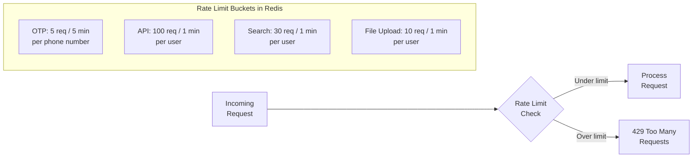
```mermaid
graph LR
    A["Incoming<br/>Request"] --> B{"Rate Limit<br/>Check"}
    B -->|Under limit| C["Process<br/>Request"]
    B -->|Over limit| D["429 Too Many<br/>Requests"]

    subgraph "Rate Limit Buckets in Redis"
        E["OTP: 5 req / 5 min<br/>per phone number"]
        F["API: 100 req / 1 min<br/>per user"]
        G["Search: 30 req / 1 min<br/>per user"]
        H["File Upload: 10 req / 1 min<br/>per user"]
    end
```

### 4.7 Input Validation

```java
// Example: CreateJobRequest with comprehensive validation
public record CreateJobRequest(
    @NotBlank(message = "Title is required")
    @Size(min = 5, max = 200, message = "Title must be 5-200 characters")
    String title,

    @NotBlank(message = "Description is required")
    @Size(min = 20, max = 2000, message = "Description must be 20-2000 characters")
    String description,

    @NotBlank(message = "Category is required")
    @Pattern(regexp = "^(CARPENTER|PLUMBER|ELECTRICIAN|PAINTER|AC_REPAIR|"
        + "CLEANING|PEST_CONTROL|APPLIANCE_REPAIR|MASON|WELDER|GARDENER)$",
        message = "Invalid job category")
    String category,

    @NotNull(message = "Location is required")
    @Valid
    LocationDto location,

    @NotNull(message = "Minimum budget is required")
    @DecimalMin(value = "50.00", message = "Minimum budget must be at least 50")
    @DecimalMax(value = "500000.00", message = "Maximum budget cannot exceed 500000")
    BigDecimal budgetMin,

    @NotNull(message = "Maximum budget is required")
    BigDecimal budgetMax,

    @Pattern(regexp = "^(NORMAL|URGENT|EMERGENCY)$", message = "Invalid urgency level")
    String urgency
) {
    // Custom validation: budgetMax >= budgetMin
    @AssertTrue(message = "Maximum budget must be >= minimum budget")
    public boolean isBudgetValid() {
        return budgetMax == null || budgetMin == null ||
            budgetMax.compareTo(budgetMin) >= 0;
    }
}
```

---

## 5. Real-time Communication

### 5.1 WebSocket Architecture for Chat

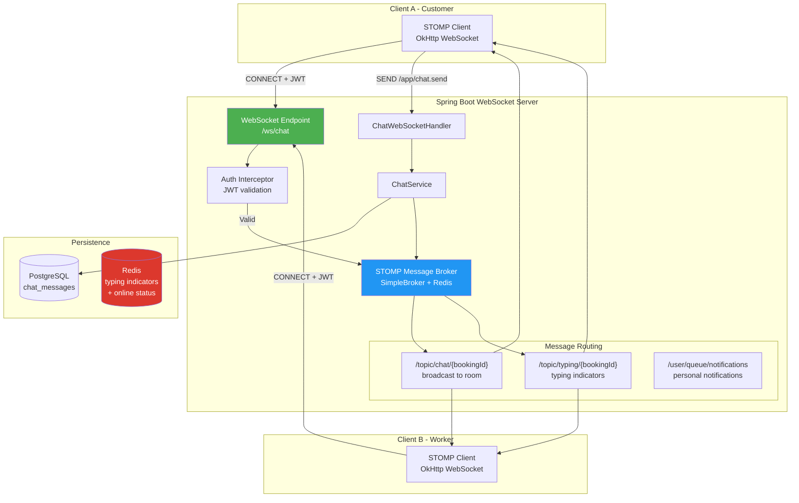
```mermaid
graph TB
    subgraph "Client A - Customer"
        CA["STOMP Client<br/>OkHttp WebSocket"]
    end

    subgraph "Client B - Worker"
        CB["STOMP Client<br/>OkHttp WebSocket"]
    end

    subgraph "Spring Boot WebSocket Server"
        WS["WebSocket Endpoint<br/>/ws/chat"]
        AI["Auth Interceptor<br/>JWT validation"]
        MB["STOMP Message Broker<br/>SimpleBroker + Redis"]

        subgraph "Message Routing"
            SUB1["/topic/chat/{bookingId}<br/>broadcast to room"]
            SUB2["/topic/typing/{bookingId}<br/>typing indicators"]
            SUB3["/user/queue/notifications<br/>personal notifications"]
        end

        CH["ChatWebSocketHandler"]
        CS["ChatService"]
    end

    subgraph "Persistence"
        DB[("PostgreSQL<br/>chat_messages")]
        Redis[("Redis<br/>typing indicators<br/>+ online status")]
    end

    CA -->|"CONNECT + JWT"| WS
    CB -->|"CONNECT + JWT"| WS
    WS --> AI
    AI -->|"Valid"| MB

    CA -->|"SEND /app/chat.send"| CH
    CH --> CS
    CS --> DB
    CS --> MB

    MB --> SUB1
    SUB1 --> CA
    SUB1 --> CB

    MB --> SUB2
    SUB2 --> CA
    SUB2 --> CB

    style WS fill:#4CAF50,color:#fff
    style MB fill:#2196F3,color:#fff
    style Redis fill:#DC382D,color:#fff
```

**WebSocket Config:**

```java
@Configuration
@EnableWebSocketMessageBroker
public class WebSocketConfig implements WebSocketMessageBrokerConfigurer {

    @Override
    public void configureMessageBroker(MessageBrokerRegistry config) {
        // Clients subscribe to /topic/* for broadcasts
        config.enableSimpleBroker("/topic", "/queue");
        // Clients send to /app/* which routes to @MessageMapping methods
        config.setApplicationDestinationPrefixes("/app");
        // User-specific destinations
        config.setUserDestinationPrefix("/user");
    }

    @Override
    public void registerStompEndpoints(StompEndpointRegistry registry) {
        registry.addEndpoint("/ws/chat")
                .setAllowedOriginPatterns("*")
                .withSockJS(); // Fallback for older clients
    }

    @Override
    public void configureClientInboundChannel(ChannelRegistration registration) {
        registration.interceptors(new WebSocketAuthInterceptor(jwtTokenProvider));
    }
}
```

**Message Flow:**

```java
@Controller
public class ChatController {

    @MessageMapping("/chat.send")
    public void sendMessage(
        @Payload ChatMessageDto message,
        SimpMessageHeaderAccessor headerAccessor
    ) {
        UUID senderId = extractUserId(headerAccessor);

        // 1. Persist to database
        ChatMessage saved = chatService.saveMessage(
            message.getBookingId(),
            senderId,
            message.getContent(),
            message.getType()
        );

        // 2. Broadcast to booking room
        messagingTemplate.convertAndSend(
            "/topic/chat/" + message.getBookingId(),
            ChatMessageResponse.from(saved)
        );

        // 3. If receiver is offline, send push notification
        if (!isUserOnline(message.getReceiverId())) {
            notificationService.sendChatPush(
                message.getReceiverId(),
                saved
            );
        }
    }

    @MessageMapping("/chat.typing")
    public void typing(@Payload TypingEvent event,
                        SimpMessageHeaderAccessor headerAccessor) {
        UUID userId = extractUserId(headerAccessor);
        // Broadcast typing indicator (no persistence)
        messagingTemplate.convertAndSend(
            "/topic/typing/" + event.getBookingId(),
            new TypingResponse(userId, true)
        );
    }
}
```

### 5.2 Push Notification Flow — FCM

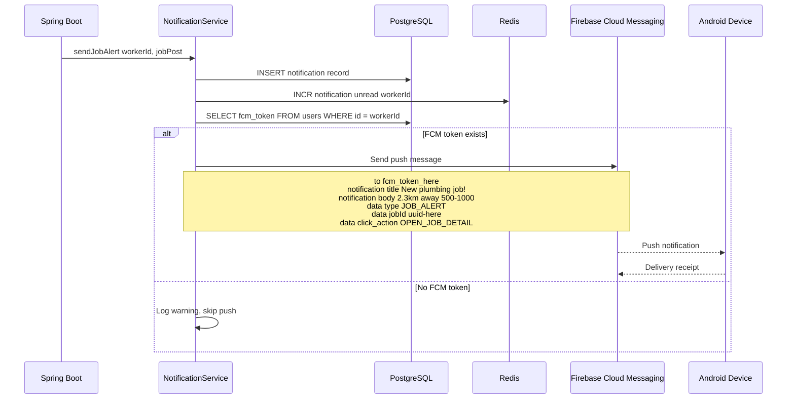
```mermaid
sequenceDiagram
    participant API as Spring Boot
    participant NS as NotificationService
    participant DB as PostgreSQL
    participant Redis as Redis
    participant FCM as Firebase Cloud Messaging
    participant Device as Android Device

    API->>NS: sendJobAlert workerId, jobPost
    NS->>DB: INSERT notification record
    NS->>Redis: INCR notification unread workerId
    NS->>DB: SELECT fcm_token FROM users WHERE id = workerId

    alt FCM token exists
        NS->>FCM: Send push message
        Note over NS,FCM: to fcm_token_here<br/>notification title New plumbing job!<br/>notification body 2.3km away 500-1000<br/>data type JOB_ALERT<br/>data jobId uuid-here<br/>data click_action OPEN_JOB_DETAIL
        FCM-->>Device: Push notification
        Device-->>FCM: Delivery receipt
    else No FCM token
        NS->>NS: Log warning, skip push
    end
```

### 5.3 WhatsApp Integration Flow

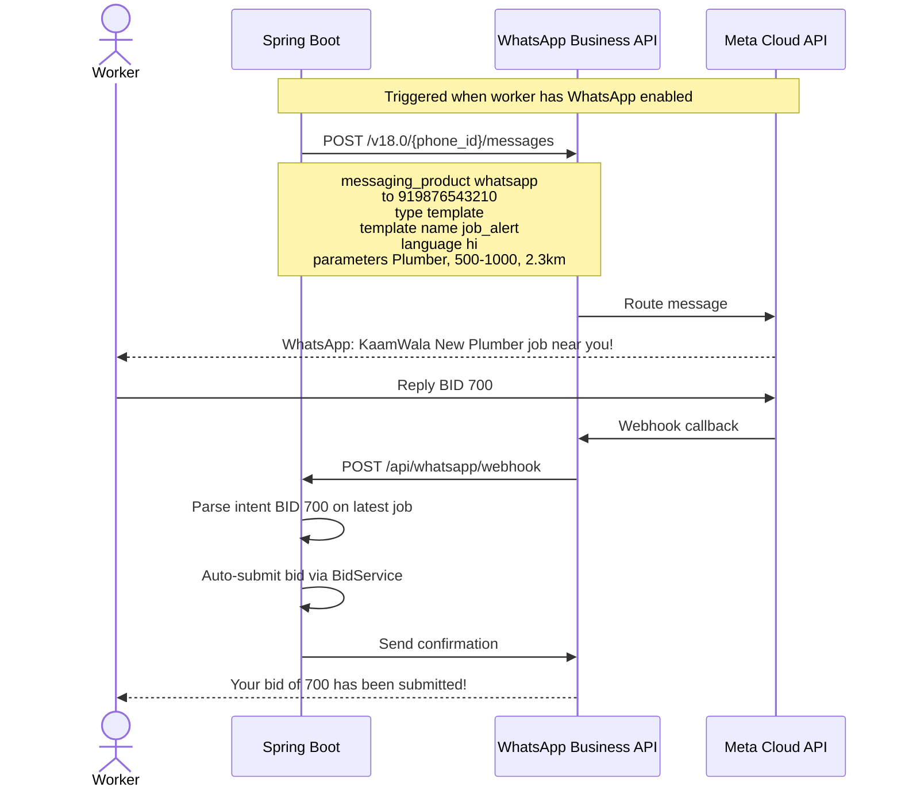
```mermaid
sequenceDiagram
    actor W as Worker
    participant API as Spring Boot
    participant WA as WhatsApp Business API
    participant Meta as Meta Cloud API

    Note over API,Meta: Triggered when worker has WhatsApp enabled

    API->>WA: POST /v18.0/{phone_id}/messages
    Note over API,WA: messaging_product whatsapp<br/>to 919876543210<br/>type template<br/>template name job_alert<br/>language hi<br/>parameters Plumber, 500-1000, 2.3km
    WA->>Meta: Route message
    Meta-->>W: WhatsApp: KaamWala New Plumber job near you!

    W->>Meta: Reply BID 700
    Meta->>WA: Webhook callback
    WA->>API: POST /api/whatsapp/webhook
    API->>API: Parse intent BID 700 on latest job
    API->>API: Auto-submit bid via BidService
    API->>WA: Send confirmation
    WA-->>W: Your bid of 700 has been submitted!
```

---

## 6. Android App Architecture

### 6.1 MVVM + Clean Architecture

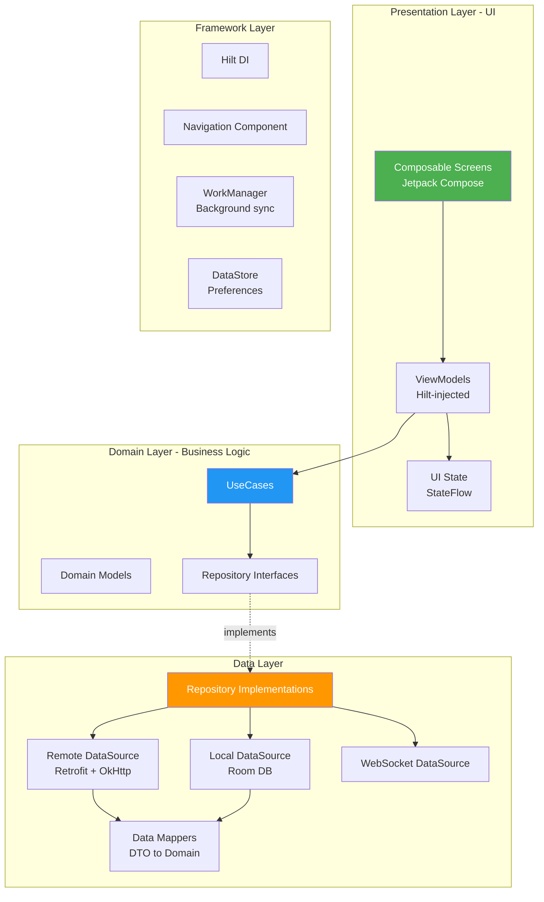
```mermaid
graph TB
    subgraph "Presentation Layer - UI"
        direction LR
        V1["Composable Screens<br/>Jetpack Compose"]
        VM1["ViewModels<br/>Hilt-injected"]
        S1["UI State<br/>StateFlow"]
    end

    subgraph "Domain Layer - Business Logic"
        direction LR
        UC1["UseCases"]
        M1["Domain Models"]
        RI1["Repository Interfaces"]
    end

    subgraph "Data Layer"
        direction LR
        R1["Repository Implementations"]
        DS1["Remote DataSource<br/>Retrofit + OkHttp"]
        DS2["Local DataSource<br/>Room DB"]
        DS3["WebSocket DataSource"]
        MP1["Data Mappers<br/>DTO to Domain"]
    end

    subgraph "Framework Layer"
        direction LR
        DI["Hilt DI"]
        NAV["Navigation Component"]
        WM["WorkManager<br/>Background sync"]
        DS["DataStore<br/>Preferences"]
    end

    V1 --> VM1
    VM1 --> S1
    VM1 --> UC1
    UC1 --> RI1
    RI1 -.->|"implements"| R1
    R1 --> DS1 & DS2 & DS3
    DS1 & DS2 --> MP1

    style V1 fill:#4CAF50,color:#fff
    style UC1 fill:#2196F3,color:#fff
    style R1 fill:#FF9800,color:#fff
```

### 6.2 Android Package Structure

```
app/src/main/java/com/kaamwala/
├── KaamWalaApp.kt                      # Application class (@HiltAndroidApp)
│
├── di/                                  # Dependency Injection
│   ├── NetworkModule.kt                # Retrofit, OkHttp, WebSocket
│   ├── DatabaseModule.kt              # Room database
│   ├── RepositoryModule.kt            # Repository bindings
│   └── UseCaseModule.kt               # UseCase providers
│
├── data/                                # Data Layer
│   ├── remote/
│   │   ├── api/
│   │   │   ├── AuthApi.kt             # Auth endpoints
│   │   │   ├── JobApi.kt              # Job endpoints
│   │   │   ├── BidApi.kt              # Bid endpoints
│   │   │   ├── BookingApi.kt          # Booking endpoints
│   │   │   ├── WorkerApi.kt           # Worker endpoints
│   │   │   └── ChatApi.kt             # Chat REST endpoints
│   │   ├── dto/                        # API DTOs
│   │   └── websocket/
│   │       └── ChatWebSocketClient.kt
│   ├── local/
│   │   ├── KaamWalaDatabase.kt        # Room database
│   │   ├── dao/
│   │   │   ├── JobDao.kt
│   │   │   ├── BookingDao.kt
│   │   │   └── ChatMessageDao.kt
│   │   └── entity/                     # Room entities
│   ├── repository/                     # Repository implementations
│   │   ├── AuthRepositoryImpl.kt
│   │   ├── JobRepositoryImpl.kt
│   │   ├── BidRepositoryImpl.kt
│   │   ├── BookingRepositoryImpl.kt
│   │   └── ChatRepositoryImpl.kt
│   └── mapper/                         # DTO to Domain mappers
│
├── domain/                              # Domain Layer
│   ├── model/                           # Domain models (pure Kotlin)
│   │   ├── User.kt
│   │   ├── Job.kt
│   │   ├── Bid.kt
│   │   ├── Booking.kt
│   │   └── ChatMessage.kt
│   ├── repository/                     # Repository interfaces
│   │   ├── AuthRepository.kt
│   │   ├── JobRepository.kt
│   │   └── ChatRepository.kt
│   └── usecase/                        # Use cases
│       ├── auth/
│       │   ├── SendOtpUseCase.kt
│       │   └── VerifyOtpUseCase.kt
│       ├── job/
│       │   ├── CreateJobUseCase.kt
│       │   ├── GetNearbyJobsUseCase.kt
│       │   └── GetJobBidsUseCase.kt
│       ├── booking/
│       │   ├── CreateBookingUseCase.kt
│       │   └── TrackWorkerUseCase.kt
│       └── chat/
│           └── SendMessageUseCase.kt
│
├── presentation/                        # UI Layer
│   ├── navigation/
│   │   └── KaamWalaNavGraph.kt         # Compose Navigation
│   ├── theme/
│   │   ├── Color.kt
│   │   ├── Typography.kt
│   │   └── Theme.kt
│   ├── common/
│   │   ├── LoadingIndicator.kt
│   │   └── ErrorScreen.kt
│   └── screens/
│       ├── splash/
│       │   └── SplashScreen.kt
│       ├── auth/
│       │   ├── LoginScreen.kt
│       │   ├── OtpScreen.kt
│       │   ├── RoleSelectionScreen.kt
│       │   └── AuthViewModel.kt
│       ├── customer/
│       │   ├── home/
│       │   │   ├── CustomerHomeScreen.kt
│       │   │   └── CustomerHomeViewModel.kt
│       │   ├── postjob/
│       │   │   ├── PostJobScreen.kt
│       │   │   └── PostJobViewModel.kt
│       │   ├── bids/
│       │   │   ├── BidListScreen.kt
│       │   │   └── BidListViewModel.kt
│       │   └── booking/
│       │       ├── BookingDetailScreen.kt
│       │       └── BookingViewModel.kt
│       ├── worker/
│       │   ├── home/
│       │   │   ├── WorkerHomeScreen.kt
│       │   │   └── WorkerHomeViewModel.kt
│       │   ├── profile/
│       │   │   ├── WorkerProfileScreen.kt
│       │   │   └── WorkerProfileViewModel.kt
│       │   └── jobs/
│       │       ├── NearbyJobsScreen.kt
│       │       └── NearbyJobsViewModel.kt
│       ├── chat/
│       │   ├── ChatScreen.kt
│       │   └── ChatViewModel.kt
│       └── review/
│           ├── ReviewScreen.kt
│           └── ReviewViewModel.kt
│
└── util/                                # Utilities
    ├── NetworkMonitor.kt
    ├── LocationHelper.kt
    └── Constants.kt
```

### 6.3 Screen Flow / Navigation Graph

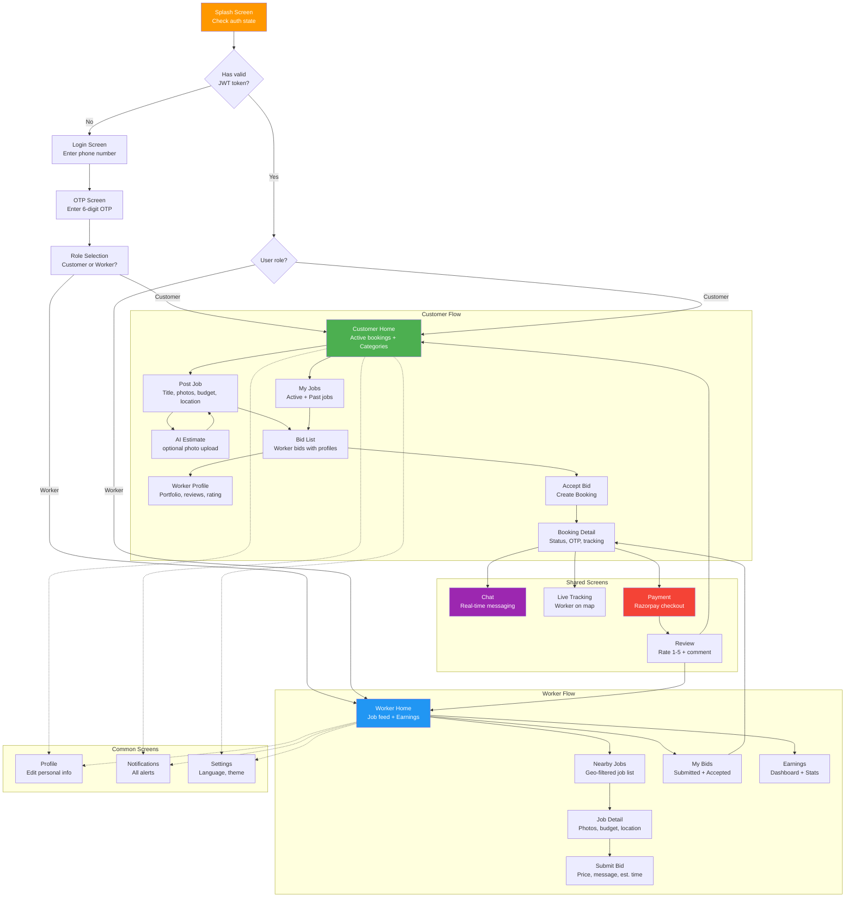
```mermaid
graph TD
    SPLASH["Splash Screen<br/>Check auth state"] --> AUTH_CHECK{"Has valid<br/>JWT token?"}
    AUTH_CHECK -->|No| LOGIN["Login Screen<br/>Enter phone number"]
    AUTH_CHECK -->|Yes| ROLE_CHECK{"User role?"}

    LOGIN --> OTP["OTP Screen<br/>Enter 6-digit OTP"]
    OTP --> ROLE_SELECT["Role Selection<br/>Customer or Worker?"]
    ROLE_SELECT -->|Customer| CUST_HOME
    ROLE_SELECT -->|Worker| WORK_HOME

    ROLE_CHECK -->|Customer| CUST_HOME
    ROLE_CHECK -->|Worker| WORK_HOME

    subgraph "Customer Flow"
        CUST_HOME["Customer Home<br/>Active bookings + Categories"]
        CUST_HOME --> POST_JOB["Post Job<br/>Title, photos, budget, location"]
        CUST_HOME --> MY_JOBS["My Jobs<br/>Active + Past jobs"]
        POST_JOB --> AI_EST["AI Estimate<br/>optional photo upload"]
        AI_EST --> POST_JOB
        POST_JOB --> BID_LIST["Bid List<br/>Worker bids with profiles"]
        MY_JOBS --> BID_LIST
        BID_LIST --> WORKER_PROFILE_VIEW["Worker Profile<br/>Portfolio, reviews, rating"]
        BID_LIST --> ACCEPT_BID["Accept Bid<br/>Create Booking"]
        ACCEPT_BID --> BOOKING_DETAIL
    end

    subgraph "Worker Flow"
        WORK_HOME["Worker Home<br/>Job feed + Earnings"]
        WORK_HOME --> NEARBY_JOBS["Nearby Jobs<br/>Geo-filtered job list"]
        WORK_HOME --> MY_BIDS["My Bids<br/>Submitted + Accepted"]
        WORK_HOME --> EARNINGS["Earnings<br/>Dashboard + Stats"]
        NEARBY_JOBS --> JOB_DETAIL["Job Detail<br/>Photos, budget, location"]
        JOB_DETAIL --> SUBMIT_BID["Submit Bid<br/>Price, message, est. time"]
        MY_BIDS --> BOOKING_DETAIL
    end

    subgraph "Shared Screens"
        BOOKING_DETAIL["Booking Detail<br/>Status, OTP, tracking"]
        BOOKING_DETAIL --> CHAT["Chat<br/>Real-time messaging"]
        BOOKING_DETAIL --> TRACKING["Live Tracking<br/>Worker on map"]
        BOOKING_DETAIL --> PAYMENT["Payment<br/>Razorpay checkout"]
        PAYMENT --> REVIEW["Review<br/>Rate 1-5 + comment"]
        REVIEW --> CUST_HOME
        REVIEW --> WORK_HOME
    end

    subgraph "Common Screens"
        PROFILE["Profile<br/>Edit personal info"]
        NOTIFICATIONS["Notifications<br/>All alerts"]
        SETTINGS["Settings<br/>Language, theme"]
    end

    CUST_HOME -.-> PROFILE & NOTIFICATIONS & SETTINGS
    WORK_HOME -.-> PROFILE & NOTIFICATIONS & SETTINGS

    style SPLASH fill:#FF9800,color:#fff
    style CUST_HOME fill:#4CAF50,color:#fff
    style WORK_HOME fill:#2196F3,color:#fff
    style CHAT fill:#9C27B0,color:#fff
    style PAYMENT fill:#F44336,color:#fff
```

### 6.4 Offline-First Strategy with Room DB

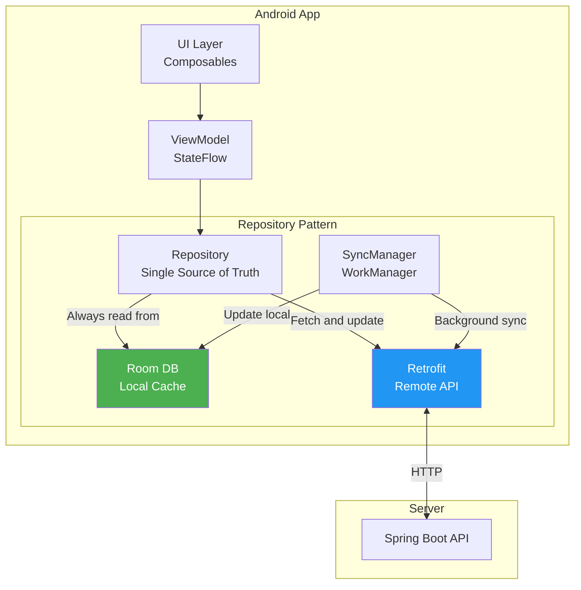
```mermaid
graph TB
    subgraph "Android App"
        UI["UI Layer<br/>Composables"]
        VM["ViewModel<br/>StateFlow"]

        subgraph "Repository Pattern"
            REPO["Repository<br/>Single Source of Truth"]
            LOCAL["Room DB<br/>Local Cache"]
            REMOTE["Retrofit<br/>Remote API"]
            SYNC["SyncManager<br/>WorkManager"]
        end
    end

    subgraph "Server"
        API["Spring Boot API"]
    end

    UI --> VM --> REPO
    REPO -->|"Always read from"| LOCAL
    REPO -->|"Fetch and update"| REMOTE
    REMOTE <-->|"HTTP"| API
    SYNC -->|"Background sync"| REMOTE
    SYNC -->|"Update local"| LOCAL

    style LOCAL fill:#4CAF50,color:#fff
    style REMOTE fill:#2196F3,color:#fff
```

**Offline Strategy by Feature:**

| Feature | Offline Support | Strategy |
|---------|-----------------|----------|
| Job Feed | Yes, Read-only | Cache last 50 jobs in Room. Show stale data with Last Updated badge |
| My Bookings | Yes, Read-only | Full booking history cached |
| Chat Messages | Yes, Read + Write | Messages queued in Room, sent when online via optimistic UI |
| Submit Bid | Yes, Queue | Bid stored in pending_actions table, synced via WorkManager |
| Post Job | Partial | Form data saved as draft; photos queued for upload |
| Payment | No, Online only | Razorpay SDK requires network |
| Live Tracking | No, Online only | Real-time GPS requires network |
| Notifications | Yes, Cached | Last 100 notifications stored locally |

### 6.5 State Management

```kotlin
// Sealed class for UI state — replaces boolean flags
sealed class UiState<out T> {
    data object Loading : UiState<Nothing>()
    data class Success<T>(val data: T) : UiState<T>()
    data class Error(val message: String, val retry: (() -> Unit)? = null) : UiState<Nothing>()
    data object Empty : UiState<Nothing>()
}

// ViewModel example — Job feed
@HiltViewModel
class NearbyJobsViewModel @Inject constructor(
    private val getNearbyJobsUseCase: GetNearbyJobsUseCase,
    private val locationHelper: LocationHelper
) : ViewModel() {

    private val _uiState = MutableStateFlow<UiState<List<Job>>>(UiState.Loading)
    val uiState: StateFlow<UiState<List<Job>>> = _uiState.asStateFlow()

    private val _selectedCategory = MutableStateFlow<String?>(null)
    val selectedCategory: StateFlow<String?> = _selectedCategory.asStateFlow()

    init {
        loadJobs()
    }

    fun loadJobs(category: String? = null) {
        viewModelScope.launch {
            _uiState.value = UiState.Loading
            val location = locationHelper.getCurrentLocation()
            getNearbyJobsUseCase(
                lat = location.latitude,
                lng = location.longitude,
                category = category,
                radiusKm = 15
            ).catch { e ->
                _uiState.value = UiState.Error(
                    message = e.message ?: "Failed to load jobs",
                    retry = { loadJobs(category) }
                )
            }.collect { jobs ->
                _uiState.value = if (jobs.isEmpty()) {
                    UiState.Empty
                } else {
                    UiState.Success(jobs)
                }
            }
        }
    }

    fun selectCategory(category: String) {
        _selectedCategory.value = category
        loadJobs(category)
    }
}
```

---

## 7. AI Cost Estimation Module

### 7.1 Architecture

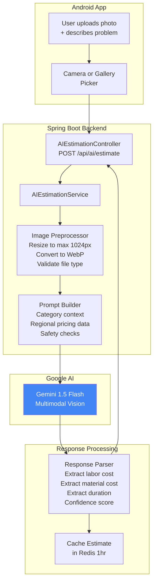
```mermaid
graph TB
    subgraph "Android App"
        U["User uploads photo<br/>+ describes problem"]
        CAM["Camera or Gallery<br/>Picker"]
    end

    subgraph "Spring Boot Backend"
        AIC["AIEstimationController<br/>POST /api/ai/estimate"]
        AIS["AIEstimationService"]
        IP["Image Preprocessor<br/>Resize to max 1024px<br/>Convert to WebP<br/>Validate file type"]
        PP["Prompt Builder<br/>Category context<br/>Regional pricing data<br/>Safety checks"]
    end

    subgraph "Google AI"
        GV["Gemini 1.5 Flash<br/>Multimodal Vision"]
    end

    subgraph "Response Processing"
        RP["Response Parser<br/>Extract labor cost<br/>Extract material cost<br/>Extract duration<br/>Confidence score"]
        CACHE["Cache Estimate<br/>in Redis 1hr"]
    end

    U --> CAM --> AIC
    AIC --> AIS
    AIS --> IP --> PP
    PP --> GV
    GV --> RP
    RP --> CACHE
    RP --> AIC

    style GV fill:#4285F4,color:#fff
```

### 7.2 Detailed Flow

```mermaid
sequenceDiagram
    actor C as Customer
    participant App as App
    participant API as API
    participant Store as Storage
    participant AI as Gemini AI
    participant Redis as Redis

    C->>App: Take photo of broken pipe + describe
    App->>App: Compress image max 1MB
    App->>API: POST /api/ai/estimate multipart image + category PLUMBER description Pipe leak

    API->>API: Validate image type size safety
    API->>Store: Upload image temporarily
    Store-->>API: image_url

    API->>AI: Gemini multimodal request
    Note over API,AI: PROMPT:<br/>You are KaamWala AI cost estimator<br/>for home services in India.<br/>Category: PLUMBER<br/>Description: Pipe leak in bathroom<br/><br/>Analyze the image and provide:<br/>1. Problem identification<br/>2. Estimated labor cost INR range<br/>3. Estimated material cost INR range<br/>4. Estimated duration hours<br/>5. Complexity LOW/MEDIUM/HIGH<br/>6. Confidence 0-100%<br/><br/>Respond in JSON format only.

    AI-->>API: JSON response
    Note over AI,API: problem: Corroded PVC pipe joint<br/>labor_cost_min: 300<br/>labor_cost_max: 600<br/>material_cost_min: 100<br/>material_cost_max: 250<br/>duration_hours: 1.5<br/>complexity: MEDIUM<br/>confidence: 82<br/>recommendations: Replace entire<br/>pipe section, Check water damage

    API->>Redis: Cache estimate TTL 1hr
    API-->>App: AIEstimationResponse

    App->>C: Display estimate card
    Note over C,App: AI Estimate:<br/>Problem: Corroded pipe joint<br/>Labor: 300 - 600<br/>Materials: 100 - 250<br/>Total: 400 - 850<br/>Duration: ~1.5 hours<br/>Confidence: 82%
```

### 7.3 Estimation Service Code

```java
@Service
@Slf4j
public class AIEstimationService {

    @Value("${google.ai.api-key}")
    private String apiKey;

    private final RestTemplate restTemplate;
    private final ObjectMapper objectMapper;
    private final RedisTemplate<String, Object> redisTemplate;

    private static final String GEMINI_URL =
        "https://generativelanguage.googleapis.com/v1beta/models/"
        + "gemini-1.5-flash:generateContent";

    public AIEstimationResponse estimate(
            MultipartFile image, String category, String description) {
        // 1. Validate & preprocess image
        validateImage(image);
        byte[] imageBytes = compressImage(image, 1024);
        String base64Image = Base64.getEncoder().encodeToString(imageBytes);

        // 2. Check cache (same category + similar description hash)
        String cacheKey = "ai:estimate:" + hashEstimateRequest(category, description);
        AIEstimationResponse cached =
            (AIEstimationResponse) redisTemplate.opsForValue().get(cacheKey);
        if (cached != null) return cached;

        // 3. Build Gemini multimodal request
        String prompt = buildPrompt(category, description);
        Map<String, Object> request = buildGeminiRequest(
            base64Image, image.getContentType(), prompt);

        // 4. Call Gemini API
        ResponseEntity<Map> response = restTemplate.postForEntity(
            GEMINI_URL + "?key=" + apiKey,
            new HttpEntity<>(request),
            Map.class
        );

        // 5. Parse response
        AIEstimationResponse result = parseGeminiResponse(response.getBody());

        // 6. Cache for 1 hour
        redisTemplate.opsForValue().set(cacheKey, result, Duration.ofHours(1));

        return result;
    }

    private String buildPrompt(String category, String description) {
        return """
            You are KaamWala AI, a cost estimation assistant for
            home services in India.
            Analyze the attached image and provide a cost estimate.

            Service Category: %s
            Customer Description: %s
            Region: Indian market pricing (INR)

            Respond ONLY in this JSON format:
            {
              "problem": "brief problem description",
              "labor_cost_min": number,
              "labor_cost_max": number,
              "material_cost_min": number,
              "material_cost_max": number,
              "duration_hours": number,
              "complexity": "LOW|MEDIUM|HIGH",
              "confidence": number (0-100),
              "recommendations": ["tip1", "tip2"]
            }
            """.formatted(category, description);
    }
}
```

---

## 8. Payment Architecture

### 8.1 Razorpay Integration Flow

```mermaid
graph TB
    subgraph "Android App"
        A["Customer confirms<br/>payment"]
        B["Razorpay Checkout<br/>SDK opens"]
        C["UPI / Card / Wallet<br/>selection"]
    end

    subgraph "Spring Boot Backend"
        D["PaymentController<br/>POST /api/bookings/{id}/pay"]
        E["PaymentService"]
        F["Create Razorpay Order<br/>amount, currency, receipt"]
        G["Verify Payment<br/>Signature Verification"]
        H["Process Payout<br/>Platform fee deduction"]
    end

    subgraph "Razorpay"
        I["Order API<br/>Create order"]
        J["Payment Processing<br/>UPI/Card/Wallet"]
        K["Webhook<br/>payment.captured"]
        L["Route API<br/>Split payment"]
    end

    subgraph "Database"
        M[("payments table")]
        N[("bookings table<br/>payment_status")]
    end

    A --> D --> E --> F
    F --> I
    I --> B --> C --> J
    J --> K --> G
    G --> H
    H --> L
    H --> M & N

    style J fill:#0066FF,color:#fff
    style L fill:#FF6600,color:#fff
```

### 8.2 Escrow-Like Payment Flow

```mermaid
sequenceDiagram
    actor C as Customer
    participant App as App
    participant API as Backend
    participant RP as Razorpay
    participant DB as Database
    actor W as Worker

    rect rgb(240, 248, 255)
        Note over C,W: Phase 1: Work Completion
        W->>API: PATCH /api/bookings/{id}/complete
        API->>DB: status = WORK_DONE
        API->>DB: Generate OTP 6 digits
        API-->>C: Push Work done! Verify with OTP 749213
    end

    rect rgb(255, 248, 240)
        Note over C,W: Phase 2: Customer Verification
        C->>App: Inspect work quality
        alt Satisfied
            C->>API: POST /api/bookings/{id}/verify-otp otp=749213
            API->>DB: Verify OTP
            API->>DB: status = VERIFIED
        else Not satisfied
            C->>API: POST /api/bookings/{id}/dispute
            API->>DB: status = DISPUTED
            Note over API: Admin reviews dispute
        end
    end

    rect rgb(240, 255, 240)
        Note over C,W: Phase 3: Payment
        API->>RP: POST /orders amount 70000 currency INR
        RP-->>API: order_id
        API-->>App: order_id + key_id

        App->>RP: Open Razorpay Checkout
        C->>RP: Pay via UPI 700
        RP-->>App: payment_id, signature

        App->>API: POST /api/bookings/{id}/pay
        API->>RP: Verify signature HMAC-SHA256
        RP-->>API: Verified
    end

    rect rgb(255, 240, 255)
        Note over C,W: Phase 4: Settlement
        API->>DB: payment_status = CAPTURED
        API->>API: Calculate splits
        Note over API: Total 700<br/>Platform fee 8%: 56<br/>Worker payout: 644
        API->>RP: POST /route transfer to worker account
        API->>DB: Record payment + splits
        API-->>W: Push 644 received!
        API-->>C: Push Payment successful. Rate your experience!
    end
```

### 8.3 Refund and Dispute Handling

```mermaid
stateDiagram-v2
    [*] --> CONFIRMED: Bid accepted
    CONFIRMED --> IN_PROGRESS: Worker starts with OTP
    IN_PROGRESS --> WORK_DONE: Worker marks complete
    WORK_DONE --> VERIFIED: Customer verifies with OTP
    WORK_DONE --> DISPUTED: Customer raises dispute

    VERIFIED --> PAYMENT_PENDING: Initiate payment
    PAYMENT_PENDING --> PAID: Payment captured
    PAID --> [*]

    DISPUTED --> ADMIN_REVIEW: Admin investigates
    ADMIN_REVIEW --> RESOLVED_CUSTOMER: Ruled for customer
    ADMIN_REVIEW --> RESOLVED_WORKER: Ruled for worker

    RESOLVED_CUSTOMER --> FULL_REFUND: 100% refund
    RESOLVED_WORKER --> PAYMENT_PENDING: Pay worker

    CONFIRMED --> CANCELLED_BY_CUSTOMER: Customer cancels
    CONFIRMED --> CANCELLED_BY_WORKER: Worker cancels

    CANCELLED_BY_CUSTOMER --> CANCELLATION_FEE: After 1 hour 50 fee
    CANCELLED_BY_WORKER --> NO_CHARGE: No charge to customer

    FULL_REFUND --> [*]
    CANCELLATION_FEE --> [*]
    NO_CHARGE --> [*]
```

**Cancellation Policy:**

| Scenario | Penalty | Refund |
|----------|---------|--------|
| Customer cancels within 1 hour of booking | None | Full refund |
| Customer cancels after 1 hour | 50 cancellation fee | Partial refund |
| Customer cancels after worker starts traveling | 100 + travel cost | Partial refund |
| Worker cancels anytime | Strike on profile | No charge to customer |
| Worker no-show | 2 strikes, 3 = deactivation | Full refund |
| Dispute ruled for customer | None | Full refund |
| Dispute ruled for worker | None | Worker gets full payment |

---

## 9. Deployment Architecture

### 9.1 Cloud Infrastructure Diagram

```mermaid
graph TB
    subgraph "Internet"
        USERS["Android Users"]
        ADMIN["Admin Panel"]
    end

    subgraph "Google Cloud Platform or AWS"
        subgraph "Edge Layer"
            CDN["Cloud CDN<br/>Static assets"]
            LB["Cloud Load Balancer<br/>SSL termination"]
        end

        subgraph "Compute Layer"
            subgraph "GKE or ECS Cluster"
                API1["API Instance 1<br/>Spring Boot"]
                API2["API Instance 2<br/>Spring Boot"]
                API3["API Instance 3<br/>Spring Boot"]
            end
            WS1["WebSocket Server<br/>Sticky sessions"]
        end

        subgraph "Data Layer"
            PG["Cloud SQL<br/>PostgreSQL 16<br/>+ PostGIS Primary"]
            PGR["Cloud SQL<br/>PostgreSQL<br/>Read Replica"]
            REDIS["Memorystore<br/>Redis 7 HA Cluster"]
            ES["Elasticsearch<br/>Service 3-node cluster"]
        end

        subgraph "Storage Layer"
            GCS["Cloud Storage<br/>Uploads, backups"]
        end

        subgraph "Monitoring"
            PROM["Prometheus"]
            GRAF["Grafana Dashboards"]
            ALERT["Alertmanager"]
            LOGS["Cloud Logging"]
        end
    end

    subgraph "Firebase"
        FAUTH["Firebase Auth"]
        FSTORE["Firebase Storage"]
        FFCM["FCM"]
    end

    subgraph "External APIs"
        RAZORPAY["Razorpay"]
        GMAPS["Google Maps"]
        GEMINI["Gemini AI"]
        WHATSAPP["WhatsApp API"]
    end

    USERS --> CDN --> LB
    ADMIN --> LB
    LB --> API1 & API2 & API3
    LB -->|"WS upgrade"| WS1

    API1 & API2 & API3 --> PG
    API1 & API2 & API3 --> PGR
    API1 & API2 & API3 --> REDIS
    API1 & API2 & API3 --> ES
    WS1 --> REDIS

    API1 --> FAUTH & FSTORE & FFCM
    API1 --> RAZORPAY & GMAPS & GEMINI & WHATSAPP
    API1 --> GCS

    PROM --> API1 & API2 & API3
    PROM --> GRAF
    PROM --> ALERT

    style LB fill:#4285F4,color:#fff
    style PG fill:#336791,color:#fff
    style REDIS fill:#DC382D,color:#fff
```

### 9.2 CI/CD Pipeline

```mermaid
graph LR
    subgraph "Developer"
        DEV["Push to<br/>GitHub"]
    end

    subgraph "GitHub Actions"
        T1["Run Tests<br/>mvnw test"]
        T2["Code Quality<br/>SonarQube scan"]
        T3["Security Scan<br/>OWASP dependency check"]
        T4["Build Docker<br/>Image"]
        T5["Push to<br/>Container Registry"]
    end

    subgraph "Deployment"
        STG["Staging<br/>Auto-deploy"]
        SMOKE["Smoke Tests<br/>API health checks"]
        PROD["Production<br/>Manual approval"]
        ROLLBACK["Auto Rollback<br/>if health fails"]
    end

    DEV --> T1 --> T2 --> T3 --> T4 --> T5
    T5 --> STG --> SMOKE
    SMOKE -->|"Pass"| PROD
    SMOKE -->|"Fail"| ROLLBACK
    PROD -->|"Health fail"| ROLLBACK
```

**GitHub Actions Workflow:**

```yaml
# .github/workflows/deploy.yml
name: Build and Deploy KaamWala API

on:
  push:
    branches: [main, develop]
  pull_request:
    branches: [main]

env:
  REGISTRY: gcr.io/${{ secrets.GCP_PROJECT_ID }}
  IMAGE_NAME: kaamwala-api

jobs:
  test:
    runs-on: ubuntu-latest
    services:
      postgres:
        image: postgis/postgis:16-3.4
        env:
          POSTGRES_DB: kaamwala_test
          POSTGRES_USER: test
          POSTGRES_PASSWORD: test
        ports: ['5432:5432']
      redis:
        image: redis:7-alpine
        ports: ['6379:6379']

    steps:
      - uses: actions/checkout@v4
      - uses: actions/setup-java@v4
        with:
          java-version: '21'
          distribution: 'temurin'
      - run: ./mvnw test -Dspring.profiles.active=test

  build-and-push:
    needs: test
    runs-on: ubuntu-latest
    if: github.ref == 'refs/heads/main'
    steps:
      - uses: actions/checkout@v4
      - run: ./mvnw package -DskipTests
      - uses: google-github-actions/setup-gcloud@v2
      - run: |
          gcloud auth configure-docker gcr.io
          docker build -t $REGISTRY/$IMAGE_NAME:${{ github.sha }} .
          docker push $REGISTRY/$IMAGE_NAME:${{ github.sha }}

  deploy-staging:
    needs: build-and-push
    runs-on: ubuntu-latest
    steps:
      - run: |
          gcloud run deploy kaamwala-api-staging \
            --image $REGISTRY/$IMAGE_NAME:${{ github.sha }} \
            --region asia-south1 \
            --platform managed

  deploy-production:
    needs: deploy-staging
    runs-on: ubuntu-latest
    environment: production  # Requires manual approval
    steps:
      - run: |
          gcloud run deploy kaamwala-api \
            --image $REGISTRY/$IMAGE_NAME:${{ github.sha }} \
            --region asia-south1 \
            --platform managed \
            --min-instances 2 \
            --max-instances 20
```

### 9.3 Docker Setup

```dockerfile
# Dockerfile — Multi-stage build
# Stage 1: Build
FROM eclipse-temurin:21-jdk-alpine AS builder
WORKDIR /app
COPY pom.xml .
COPY .mvn .mvn
COPY mvnw .
RUN chmod +x mvnw && ./mvnw dependency:go-offline -B
COPY src src
RUN ./mvnw package -DskipTests -B

# Stage 2: Run
FROM eclipse-temurin:21-jre-alpine
WORKDIR /app

# Security: non-root user
RUN addgroup -S kaamwala && adduser -S kaamwala -G kaamwala
USER kaamwala

COPY --from=builder /app/target/kaamwala-api-*.jar app.jar

# Upload directory
RUN mkdir -p /app/uploads

EXPOSE 8080

HEALTHCHECK --interval=30s --timeout=3s \
  CMD wget -qO- http://localhost:8080/actuator/health || exit 1

ENTRYPOINT ["java", \
  "-XX:+UseG1GC", \
  "-XX:MaxRAMPercentage=75.0", \
  "-Djava.security.egd=file:/dev/./urandom", \
  "-jar", "app.jar"]
```

```yaml
# docker-compose.yml — Local development
version: '3.9'

services:
  api:
    build: .
    ports:
      - "8080:8080"
    environment:
      - SPRING_PROFILES_ACTIVE=local
      - DB_USERNAME=kaamwala
      - DB_PASSWORD=secret
      - REDIS_HOST=redis
      - ELASTICSEARCH_URI=http://elasticsearch:9200
    depends_on:
      postgres:
        condition: service_healthy
      redis:
        condition: service_started
    volumes:
      - ./uploads:/app/uploads

  postgres:
    image: postgis/postgis:16-3.4
    environment:
      POSTGRES_DB: kaamwala
      POSTGRES_USER: kaamwala
      POSTGRES_PASSWORD: secret
    ports:
      - "5432:5432"
    volumes:
      - pgdata:/var/lib/postgresql/data
      - ./src/main/resources/db/init.sql:/docker-entrypoint-initdb.d/init.sql
    healthcheck:
      test: ["CMD-SHELL", "pg_isready -U kaamwala"]
      interval: 10s
      timeout: 5s
      retries: 5

  redis:
    image: redis:7-alpine
    ports:
      - "6379:6379"
    command: redis-server --maxmemory 256mb --maxmemory-policy allkeys-lru

  elasticsearch:
    image: docker.elastic.co/elasticsearch/elasticsearch:8.12.0
    environment:
      - discovery.type=single-node
      - xpack.security.enabled=false
      - "ES_JAVA_OPTS=-Xms512m -Xmx512m"
    ports:
      - "9200:9200"
    volumes:
      - esdata:/usr/share/elasticsearch/data

volumes:
  pgdata:
  esdata:
```

### 9.4 Monitoring and Logging

```mermaid
graph TB
    subgraph "Metrics Collection"
        API["Spring Boot<br/>/actuator/prometheus"]
        PG_EXP["postgres_exporter"]
        REDIS_EXP["redis_exporter"]
    end

    subgraph "Prometheus"
        PROM["Prometheus Server<br/>Scrape interval 15s"]
    end

    subgraph "Grafana Dashboards"
        G1["API Metrics<br/>Request rate<br/>Response times p50 p95 p99<br/>Error rate<br/>Active WebSocket connections"]
        G2["Database Metrics<br/>Query latency<br/>Connection pool<br/>Slow queries"]
        G3["Business Metrics<br/>Jobs posted per hour<br/>Bids submitted per hour<br/>Bookings created<br/>Revenue"]
        G4["Infrastructure<br/>CPU and Memory<br/>Disk IO<br/>Network"]
    end

    subgraph "Alerting"
        ALERT["Alertmanager"]
        SLACK["Slack kaamwala-alerts"]
        PD["PagerDuty<br/>P1 alerts"]
    end

    API & PG_EXP & REDIS_EXP --> PROM
    PROM --> G1 & G2 & G3 & G4
    PROM --> ALERT
    ALERT --> SLACK & PD
```

**Key Alerts:**

| Alert | Condition | Severity | Channel |
|-------|-----------|----------|---------|
| API Down | Health check fails for 2 min | P1 Critical | PagerDuty + Slack |
| High Error Rate | 5xx errors > 5% for 5 min | P1 Critical | PagerDuty + Slack |
| Slow Response | p95 latency > 2s for 10 min | P2 Warning | Slack |
| DB Connection Pool Full | Active connections > 90% | P2 Warning | Slack |
| Redis Memory High | Memory > 80% | P2 Warning | Slack |
| Payment Failures | Failed payments > 3 in 5 min | P1 Critical | PagerDuty + Slack |
| Low Disk Space | Disk usage > 85% | P2 Warning | Slack |
| WebSocket Disconnects | > 100 disconnects per min | P3 Info | Slack |

---

## 10. Scalability Plan

### 10.1 From Monolith to Microservices

```mermaid
graph LR
    subgraph "Phase 1: Modular Monolith - Now"
        M1["Single Spring Boot App<br/>All modules in one JAR<br/>Shared PostgreSQL<br/>Single deployment"]
    end

    subgraph "Phase 2: Extract High-Load Services - 6-12 months"
        MS1["Notification Service<br/>FCM + WhatsApp<br/>Kotlin + Ktor"]
        MS2["Chat Service<br/>WebSocket<br/>Node.js or Vert.x"]
        MS3["Core API<br/>Auth + Jobs + Bids +<br/>Bookings + Payments<br/>Spring Boot"]
    end

    subgraph "Phase 3: Full Microservices - 12-24 months"
        MS4["Auth Service"]
        MS5["Job Service"]
        MS6["Bid Service"]
        MS7["Booking Service"]
        MS8["Payment Service"]
        MS9["Worker Service"]
        MS10["AI Service"]
        MS11["Notification Service"]
        MS12["Chat Service"]
        MQ["Event Bus<br/>Kafka or RabbitMQ"]
        GW["API Gateway<br/>Kong or Spring Cloud Gateway"]
    end

    M1 -->|"Extract first"| MS1 & MS2
    MS1 & MS2 & MS3 -->|"Full decomposition"| MS4 & MS5 & MS6 & MS7 & MS8
    MS4 & MS5 & MS6 & MS7 & MS8 --> MQ
    MS9 & MS10 & MS11 & MS12 --> MQ
    GW --> MS4 & MS5 & MS6 & MS7 & MS8 & MS9 & MS10 & MS11 & MS12
```

### 10.2 Extraction Priority

| Priority | Service | Why Extract First | Trigger |
|----------|---------|-------------------|---------|
| 1 | Notification Service | Highest throughput, can be async, different scaling needs | > 10K notifications per hour |
| 2 | Chat Service | WebSocket needs sticky sessions, different runtime event-driven | > 5K concurrent connections |
| 3 | AI Estimation | CPU-intensive, can use GPU instances, different scaling | > 1K estimations per day |
| 4 | Payment Service | Compliance isolation, PCI DSS, independent scaling | Regulatory requirement |
| 5 | Job + Bid | Highest DB write load, needs read replicas | > 50K jobs per day |
| 6 | Auth | Stateless, easy to extract | > 100K users |

### 10.3 Horizontal Scaling Strategy

```mermaid
graph TB
    subgraph "Auto-Scaling"
        LB["Load Balancer<br/>Round Robin"]

        subgraph "API Instances - Stateless"
            A1["Instance 1"]
            A2["Instance 2"]
            A3["Instance 3"]
            AN["Instance N<br/>auto-scale"]
        end

        subgraph "WebSocket Instances - Sticky"
            WS1["WS Instance 1"]
            WS2["WS Instance 2"]
        end
    end

    subgraph "Shared State - Redis"
        RC["Redis Cluster<br/>Sessions<br/>WS pub/sub<br/>Cache"]
    end

    subgraph "Database - Read Replicas"
        PW["PostgreSQL<br/>Primary Write"]
        PR1["Read Replica 1<br/>Job queries"]
        PR2["Read Replica 2<br/>Analytics"]
    end

    LB --> A1 & A2 & A3 & AN
    LB -->|"WS upgrade<br/>sticky session"| WS1 & WS2
    A1 & A2 & A3 & AN --> RC
    WS1 & WS2 --> RC
    A1 & A2 --> PW
    A3 & AN --> PR1 & PR2

    style RC fill:#DC382D,color:#fff
    style PW fill:#336791,color:#fff
```

**Auto-Scaling Rules:**

| Metric | Scale Up | Scale Down | Min | Max |
|--------|----------|------------|-----|-----|
| CPU Utilization | > 70% for 3 min | < 30% for 10 min | 2 | 20 |
| Memory Utilization | > 80% | < 40% | 2 | 20 |
| Request Rate | > 500 req/s per instance | < 100 req/s | 2 | 20 |
| WebSocket Connections | > 5K per instance | < 1K | 2 | 10 |

### 10.4 Database Sharding for Multi-City

```mermaid
graph TB
    subgraph "API Gateway"
        GW["Route by city<br/>header or geo-IP"]
    end

    subgraph "Pune Shard"
        API_P["API Cluster Pune"]
        DB_P[("PostgreSQL<br/>Pune data")]
        R_P[("Redis<br/>Pune cache")]
    end

    subgraph "Mumbai Shard"
        API_M["API Cluster Mumbai"]
        DB_M[("PostgreSQL<br/>Mumbai data")]
        R_M[("Redis<br/>Mumbai cache")]
    end

    subgraph "Bangalore Shard"
        API_B["API Cluster Bangalore"]
        DB_B[("PostgreSQL<br/>Bangalore data")]
        R_B[("Redis<br/>Bangalore cache")]
    end

    subgraph "Global"
        DB_G[("PostgreSQL Global<br/>Users all cities<br/>Auth data<br/>Admin data")]
        ANALYTICS[("Analytics DB<br/>Cross-city reports")]
    end

    GW -->|"X-City pune"| API_P
    GW -->|"X-City mumbai"| API_M
    GW -->|"X-City bangalore"| API_B

    API_P --> DB_P & R_P & DB_G
    API_M --> DB_M & R_M & DB_G
    API_B --> DB_B & R_B & DB_G

    DB_P & DB_M & DB_B -->|"CDC Debezium"| ANALYTICS
```

**Sharding Strategy:**

| Data | Shard Key | Strategy | Rationale |
|------|-----------|----------|-----------|
| `users` | None, global | No sharding | Users can work across cities |
| `worker_profiles` | `primary_city` | City-based | Workers mainly serve one city |
| `job_posts` | `city` from location | City-based | Jobs are hyperlocal |
| `bids` | `job.city` | Follows job shard | Bids always reference a local job |
| `bookings` | `job.city` | Follows job shard | Bookings are local |
| `chat_messages` | `booking.city` | Follows booking shard | Chat is per booking |
| `payments` | None, global | No sharding | Financial records need consistency |
| `notifications` | `user.primary_city` | City-based | Partition by location |

> [!TIP]
> **Start with read replicas, not sharding.** Sharding adds enormous complexity. Most apps can handle millions of rows per table with proper indexing + read replicas. Only shard when a single PostgreSQL instance cannot handle the write throughput, typically more than 10K writes per second.

### 10.5 Growth Milestones

```mermaid
graph LR
    subgraph "Scale Milestones"
        S1["1K Users<br/>1 city<br/><br/>Single instance<br/>1 PostgreSQL<br/>Docker Compose"]

        S2["10K Users<br/>3 cities<br/><br/>2-3 instances<br/>Read replica<br/>Redis cache<br/>Kubernetes"]

        S3["100K Users<br/>10 cities<br/><br/>5-10 instances<br/>Microservices<br/>Kafka events<br/>City sharding"]

        S4["1M Users<br/>50+ cities<br/><br/>20+ instances<br/>Full microservices<br/>Multi-region<br/>CDN + edge"]
    end

    S1 -->|"6 months"| S2
    S2 -->|"12 months"| S3
    S3 -->|"24 months"| S4
```

---

## 11. Hyperlocal Service Discovery and Portfolio Module

A hyperlocal discovery flow connects customers to active local workers in Swaroop Nagar, Kalyanpur, Kakadeo, Govind Nagar (Kanpur) and Saket, Noida, Gurgaon, Connaught Place, Karol Bagh (Delhi NCR) across trades like Carpenters, Plumbers, Electricians, Painters, and AC Technicians.

### 11.1 Flow Architecture

```mermaid
graph TD
    Dashboard[DashboardScreen<br/>Service Grid] -->|Category Click| List[WorkerListScreen<br/>City Search & Sort]
    List -->|Worker Card Click| Profile[WorkerProfileScreen<br/>Stats & Before/After Portfolio]
    Profile -->|Book Service Click| BookingFlow[Post Job / Invite]

    subgraph "Backend API"
        Controller[WorkerController<br/>GET /api/workers] --> Service[WorkerService]
        Service --> Repo[WorkerProfileRepository<br/>searchWorkers Query]
    end

    List -->|Retrofit Client| Controller
    Profile -->|Retrofit Client| Controller
```

### 11.2 Database Mock Data
- **Seeded Workers**: 10 active profiles distributed across Delhi NCR and Kanpur.
- **Service Areas & Skills**: Populated `worker_skills` and `worker_service_areas` tables mapping specific city neighborhoods (e.g., Kalyanpur, Swaroop Nagar).
- **Seeded Portfolios**: 11 items inside `portfolio_items` mapping real Unsplash images showing structural woodwork, plumbing, circuit boards, living room wall paint, and HVAC filter servicing.

### 11.3 Search and Discover API (`GET /api/workers`)
- **Query Filters**: `category` (optional, ServiceCategory), `city` (optional, String).
- **Postgres Optimization**: Uses a SQL `EXISTS` subquery mapping against the `worker_service_areas` elements. A helper boolean `hasCity` parameter prevents passing untyped null parameters which resolves PostgreSQL `lower(bytea) does not exist` type casting issues.
- **Sorting**: Handled by Spring Data `Sort` parameters:
  - `price_asc`: Sorts by `startingPrice` ascending.
  - `price_desc`: Sorts by `startingPrice` descending.
  - `rating_desc`: Sorts by `ratingAvg` descending.

### 11.4 Frontend Compose UI Screens
- **Dashboard Grid**: A premium glassmorphic dark mode panel displaying service categories using vibrant gradient background cards and inline active location chips.
- **Worker Search/List**: Category discovery page containing a text query field for city search, horizontal filters for price and rating sorting, and list cards showing ratings, verified badges, bio snippets, and starting price values. Loaded with `Coil` image load handlers.
- **Worker Details & Portfolios**: Full banner view showing phone/email contacts, availability chips, job details, and side-by-side comparison cards displaying the "Before" (red badge) and "After" (green badge) photos of completed jobs.
- **Navigation**: Structured using type-safe Navigation3 `@Serializable` keys: `Dashboard`, `WorkerList(category: String)`, and `WorkerProfile(workerId: String)`.

### 11.5 Automated Unit Tests & Verification
The development of the discovery module is fully verified by an automated test suite and debug APK builds:
- **Test Suite**:
  - [WorkerDiscoveryViewModelTest.kt](file:///Users/Automation/.gemini/antigravity/scratch/kaamwala/frontend/app/src/test/java/com/example/kaamwala/ui/discovery/WorkerDiscoveryViewModelTest.kt): Implements tests for the Worker Discovery flow, verifying loading states, search updates, sorting, and details fetching.
  - JUnit 4 `@Before` and `@After` hooks configure an `UnconfinedTestDispatcher` mapping to `Dispatchers.Main` to ensure asynchronous ViewModel state transitions are tracked correctly during execution.
- **Verification Commands**:
  - Run all unit tests: `./gradlew :app:testDebugUnitTest` (Output: `BUILD SUCCESSFUL`)
  - Assemble full debug binary: `./gradlew assembleDebug` (Output: `BUILD SUCCESSFUL`, generating [app-debug.apk](file:///Users/Automation/.gemini/antigravity/scratch/kaamwala/frontend/app/build/outputs/apk/debug/app-debug.apk))

---

## Quick Reference Card

| Component | Technology | Version |
|-----------|-----------|---------|
| Backend | Spring Boot | 3.3.x |
| Java | Temurin JDK | 21 LTS |
| Build | Maven | 3.9+ |
| Database | PostgreSQL + PostGIS | 16 + 3.4 |
| Cache | Redis | 7 |
| Search | Elasticsearch | 8.12 |
| Auth | Firebase Auth + JWT | — |
| Push | Firebase Cloud Messaging | — |
| Payments | Razorpay | Route API v1 |
| AI | Gemini 1.5 Flash | v1beta |
| Maps | Google Maps SDK | v18+ |
| WhatsApp | Meta Cloud API | v18.0 |
| Android | Kotlin + Jetpack Compose | 1.9 + Compose BOM |
| Android DI | Hilt | 2.50 |
| Android HTTP | Retrofit 2 + OkHttp | 2.9 + 4.12 |
| Local DB | Room | 2.6 |
| Container | Docker | Multi-stage |
| Orchestration | Kubernetes GKE | 1.28+ |
| CI/CD | GitHub Actions | v4 |
| Monitoring | Prometheus + Grafana | — |

---

> [!IMPORTANT]
> **Next Steps for Developers:**
> 1. Clone the repo and run `docker-compose up` to start all dependencies
> 2. Run the Spring Boot app: `./mvnw spring-boot:run -Dspring.profiles.active=local`
> 3. Access Swagger UI at `http://localhost:8080/swagger-ui.html`
> 4. Start with the Auth flow — Create a user — Post a job — Submit a bid
> 5. Read the [implementation plan](file:///Users/Automation/.gemini/antigravity/brain/0b0b2d22-9c81-461d-967e-135bcd5de6c2/implementation_plan.md) for the full feature roadmap
